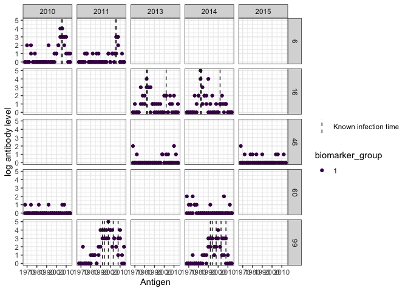
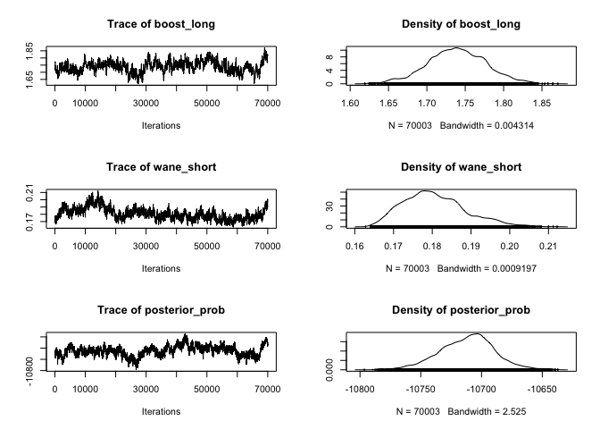
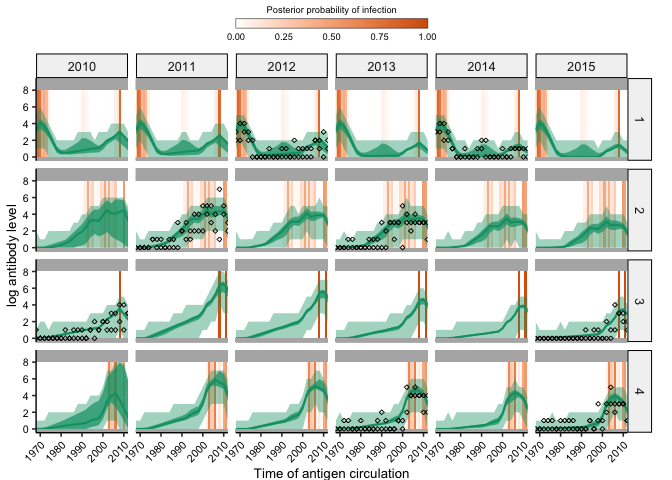

<!-- README.md is generated from README.Rmd. Please edit that file -->

# serosolver

[](https://www.repostatus.org/#active)

`serosolver` is a modelling and inference package that uses a dynamic
model to infer antibody dynamics and infection histories from
cross-sectional or longitudinal serological data. The model infers
individual-level infection histories, historical attack rates, and
patterns of antibody dynamics by accounting for cross-reactive antibody
responses and measurement error.

## Installation

1.  Install [R](http://cran.r-project.org)

2.  Install the development version of serosolver from
    [GitHub](https://github.com/seroanalytics/serosolver):

``` r
devtools::install_github("seroanalytics/serosolver")
library(serosolver)
```

## Quick start and vignettes

Read the [quick start
vignette](https://seroanalytics.github.io/serosolver/articles/serosolver-quick_start_guide.html)
to set up and run a simple implementation with a simulation model.

There are additional Rmarkdown vignettes for [Case Study
1](https://seroanalytics.github.io/serosolver/articles/cs1_vignette.html)
(longitudinal analysis of influenza A/H1N1p in Hong Kong) and [Case
Study
2](https://seroanalytics.github.io/serosolver/articles/cs2_vignette.html)
(cross-sectional analysis of influenza A/H3N2 in Guangzhou Province,
China), to accompany the analysis in the serosolver paper.

## Example

This is a basic example of simulating some serological data and fitting
the model using the MCMC framework.

``` r
library(serosolver)
library(ggplot2)
library(plyr)
library(dplyr)
library(data.table)

## Load in example parameter values and antigenic map
data(example_par_tab)
data(example_antigenic_map)
data(example_antibody_data)
data(example_inf_hist)

plot_antibody_data(example_antibody_data,example_inf_hist,example_antigenic_map$inf_times,n_indivs=5)
```



``` r

## Run the MCMC
# This example uses prior version 2 (i.e. beta prior on phi with parameters shape1 and shape2)
res <- run_MCMC(example_par_tab, example_antibody_data, example_antigenic_map,
                filename="test", prior_version=2,
                mcmc_pars=c(adaptive_period=20000, iterations=80000,save_block=10000))
#> Prior version 2: Using integrated FOI prior on infection history, with gibbs sampling of infections 
#> Setting to discretized, bounded observations
#> Creating posterior solving function...
#> Starting posterior probability:  -23232.14   
#> Starting likelihood :    -22934.38   
#> Starting prior prob:     -297.7652   
#> Setting to discretized, bounded observations
#> Creating infection history proposal function
#> Pcur hist add:   0.0403  0.0392  0.0104  0.00949 0.0452  0.0175  
#> No. infections sampled:  23  23  11  23  23  15  
#> Pcur hist move:  0.524   0.194   0.0455  0.211   0.4 0.263   
#> Move sizes:  4   2   2   2   3   2   
#> Pcur theta:  0.089   0.304   0.12    0.157   0.0421  0.0316  NaN NaN 0.0474  NaN NaN NaN 
#> Step sizes:  0.0454  0.0751  0.0497  0.0546  0.038   0.0359  0.1 0.1 0.0389  0.1 0.1 0.1 
#> Pcur group inf hist swap:    NaN 
#> Group inf hist swap propn:   1   
#> Pcur hist add:   0.0064  0.0079  0.0242  0   0   0   
#> No. infections sampled:  22  22  10  22  22  14  
#> Pcur hist move:  0.105   0.121   0.2 0.292   0.167   0   
#> Move sizes:  3   1   1   1   2   1   
#> Pcur theta:  0.0737  0.268   0.126   0.132   0.0628  0.0628  NaN NaN 0.0314  NaN NaN NaN 
#> Step sizes:  0.0196  0.0524  0.0251  0.0279  0.0158  0.0149  0.1 0.1 0.014   0.1 0.1 0.1 
#> Pcur group inf hist swap:    NaN 
#> Group inf hist swap propn:   1   
#> Pcur hist add:   0.00295 0   0.0196  0   0   0.062   
#> No. infections sampled:  21  21  9   21  21  13  
#> Pcur hist move:  0.15    0.233   0.161   0.0435  0.238   0.1 
#> Move sizes:  2   1   1   1   1   1   
#> Pcur theta:  0.304   0.346   0.246   0.284   0.111   0.158   NaN NaN 0.111   NaN NaN NaN 
#> Step sizes:  0.0147  0.0429  0.0167  0.0202  0.00763 0.00815 0.1 0.1 0.00676 0.1 0.1 0.1 
#> Pcur group inf hist swap:    NaN 
#> Group inf hist swap propn:   1   
#> Pcur hist add:   0.00992 0.00698 0   0   0   0.107   
#> No. infections sampled:  20  20  8   20  20  12  
#> Pcur hist move:  0.118   0.152   0.0455  0.278   0.118   0   
#> Move sizes:  1   1   1   1   1   1   
#> Pcur theta:  0.342   0.395   0.384   0.482   0.351   0.262   NaN NaN 0.136   NaN NaN NaN 
#> Step sizes:  0.012   0.0389  0.0148  0.0221  0.00631 0.00561 0.1 0.1 0.0035  0.1 0.1 0.1 
#> Pcur group inf hist swap:    NaN 
#> Group inf hist swap propn:   1   
#> Current iteration:   10000   
#> Pcur hist add:   0.0446  0.0233  0   0   0.0303  0.0878  
#> No. infections sampled:  19  19  7   19  19  11  
#> Pcur hist move:  0.333   0.407   0   0.174   0.111   0.12    
#> Move sizes:  1   1   1   1   1   1   
#> Pcur theta:  0.414   0.539   0.356   0.384   0.384   0.363   NaN NaN 0.453   NaN NaN NaN 
#> Step sizes:  0.0113  0.0489  0.0124  0.0196  0.0056  0.00476 0.1 0.1 0.0036  0.1 0.1 0.1 
#> Pcur group inf hist swap:    NaN 
#> Group inf hist swap propn:   1   
#> Pcur hist add:   0.0665  0.0455  0   0   0.0585  0.0584  
#> No. infections sampled:  18  18  6   18  18  10  
#> Pcur hist move:  0.136   0.235   0.122   0.125   0.321   0.1 
#> Move sizes:  1   1   1   1   1   1   
#> Pcur theta:  0.353   0.363   0.453   0.335   0.393   0.419   NaN NaN 0.342   NaN NaN NaN 
#> Step sizes:  0.00939 0.0416  0.0128  0.0157  0.00506 0.00455 0.1 0.1 0.00293 0.1 0.1 0.1 
#> Pcur group inf hist swap:    NaN 
#> Group inf hist swap propn:   1   
#> Pcur hist add:   0.0606  0.0139  0   0   0.00692 0.106   
#> No. infections sampled:  17  17  5   17  17  9   
#> Pcur hist move:  0.3 0.222   0.04    0.312   0.226   0.0435  
#> Move sizes:  1   1   1   1   1   1   
#> Pcur theta:  0.445   0.455   0.372   0.547   0.458   0.426   NaN NaN 0.435   NaN NaN NaN 
#> Step sizes:  0.00949 0.043   0.011   0.0202  0.00527 0.00442 0.1 0.1 0.00289 0.1 0.1 0.1 
#> Pcur group inf hist swap:    NaN 
#> Group inf hist swap propn:   1   
#> Pcur hist add:   0.0373  0.00984 0   0   0.00328 0.119   
#> No. infections sampled:  16  16  4   16  16  8   
#> Pcur hist move:  0.143   0.216   0.0408  0   0.258   0.0417  
#> Move sizes:  1   1   1   1   1   1   
#> Pcur theta:  0.532   0.416   0.421   0.408   0.44    0.482   NaN NaN 0.411   NaN NaN NaN 
#> Step sizes:  0.0117  0.0408  0.0106  0.0188  0.00526 0.00485 0.1 0.1 0.00271 0.1 0.1 0.1 
#> Pcur group inf hist swap:    NaN 
#> Group inf hist swap propn:   1   
#> Pcur hist add:   0.0172  0.017   0   0   0.00355 0.0328  
#> No. infections sampled:  15  15  3   15  15  7   
#> Pcur hist move:  0.286   0.278   0.0588  0.429   0.269   0.132   
#> Move sizes:  1   1   1   1   1   1   
#> Pcur theta:  0.461   0.435   0.563   0.447   0.374   0.411   NaN NaN 0.424   NaN NaN NaN 
#> Step sizes:  0.0123  0.0403  0.0141  0.0192  0.00457 0.00455 0.1 0.1 0.00262 0.1 0.1 0.1 
#> Pcur group inf hist swap:    NaN 
#> Group inf hist swap propn:   1   
#> Current iteration:   20000   
#> Pcur hist add:   0.0183  0.0107  0   0   0.00633 0.0578  
#> No. infections sampled:  14  14  2   14  14  6   
#> Pcur hist move:  0.235   0.241   0   0.231   0.292   0.0952  
#> Move sizes:  1   1   1   1   1   1   
#> Pcur theta:  0.411   0.479   0.435   0.393   0.419   0.487   NaN NaN 0.416   NaN NaN NaN 
#> Step sizes:  0.0115  0.044   0.014   0.0173  0.00436 0.00505 0.1 0.1 0.00249 0.1 0.1 0.1 
#> Pcur group inf hist swap:    NaN 
#> Group inf hist swap propn:   1   
#> Pcur:    0.382   0.408   0.358   0.489   0.505   0.379   NaN NaN 0.492   NaN NaN NaN 
#> Step sizes:  0.0115  0.044   0.014   0.0173  0.00436 0.00505 0.1 0.1 0.00249 0.1 0.1 0.1 
#> Group inf hist swap pcur:    NaN 
#> Pcur hist add:   0.0394  0.0381  0   0   0.0493  0.11    
#> Pcur hist move:  0.35    0.0357  0   0.188   0.429   0.0625  
#> Pcur:    0.426   0.4 0.372   0.461   0.482   0.363   NaN NaN 0.532   NaN NaN NaN 
#> Step sizes:  0.0115  0.044   0.014   0.0173  0.00436 0.00505 0.1 0.1 0.00249 0.1 0.1 0.1 
#> Group inf hist swap pcur:    NaN 
#> Pcur hist add:   0.0335  0.0338  0   0   0.0407  0.112   
#> Pcur hist move:  0.125   0.273   0   0.259   0.381   0.0769  
#> Pcur:    0.445   0.466   0.368   0.411   0.505   0.424   NaN NaN 0.497   NaN NaN NaN 
#> Step sizes:  0.0115  0.044   0.014   0.0173  0.00436 0.00505 0.1 0.1 0.00249 0.1 0.1 0.1 
#> Group inf hist swap pcur:    NaN 
#> Pcur hist add:   0.0389  0   0.0241  0   0.0259  0.124   
#> Pcur hist move:  0.25    0.323   0.0714  0.167   0.111   0.0741  
#> Pcur:    0.426   0.495   0.298   0.56    0.471   0.347   NaN NaN 0.537   NaN NaN NaN 
#> Step sizes:  0.0115  0.044   0.014   0.0173  0.00436 0.00505 0.1 0.1 0.00249 0.1 0.1 0.1 
#> Group inf hist swap pcur:    NaN 
#> Pcur hist add:   0.0468  0.0082  0   0   0.0426  0.087   
#> Pcur hist move:  0.278   0.189   0   0.0323  0.135   0.0645  
#> Current iteration:   30000   
#> Pcur:    0.414   0.489   0.3 0.516   0.553   0.387   NaN NaN 0.513   NaN NaN NaN 
#> Step sizes:  0.0115  0.044   0.014   0.0173  0.00436 0.00505 0.1 0.1 0.00249 0.1 0.1 0.1 
#> Group inf hist swap pcur:    NaN 
#> Pcur hist add:   0.0332  0.0312  0   0   0.0137  0.116   
#> Pcur hist move:  0.192   0.286   0   0.316   0.276   0.0714  
#> Pcur:    0.347   0.445   0.424   0.435   0.44    0.395   NaN NaN 0.489   NaN NaN NaN 
#> Step sizes:  0.0115  0.044   0.014   0.0173  0.00436 0.00505 0.1 0.1 0.00249 0.1 0.1 0.1 
#> Group inf hist swap pcur:    NaN 
#> Pcur hist add:   0.0267  0.0133  0   0   0.0321  0.149   
#> Pcur hist move:  0.208   0.237   0   0.13    0.389   0   
#> Pcur:    0.393   0.437   0.353   0.5 0.468   0.398   NaN NaN 0.461   NaN NaN NaN 
#> Step sizes:  0.0115  0.044   0.014   0.0173  0.00436 0.00505 0.1 0.1 0.00249 0.1 0.1 0.1 
#> Group inf hist swap pcur:    NaN 
#> Pcur hist add:   0.0119  0   0   0   0.0225  0.0176  
#> Pcur hist move:  0.25    0.161   0   0.227   0.226   0.128   
#> Pcur:    0.374   0.482   0.319   0.476   0.505   0.379   NaN NaN 0.511   NaN NaN NaN 
#> Step sizes:  0.0115  0.044   0.014   0.0173  0.00436 0.00505 0.1 0.1 0.00249 0.1 0.1 0.1 
#> Group inf hist swap pcur:    NaN 
#> Pcur hist add:   0.0162  0.00407 0   0   0.0202  0.0914  
#> Pcur hist move:  0.333   0.189   0   0.0476  0.24    0.111   
#> Pcur:    0.419   0.479   0.374   0.416   0.424   0.429   NaN NaN 0.435   NaN NaN NaN 
#> Step sizes:  0.0115  0.044   0.014   0.0173  0.00436 0.00505 0.1 0.1 0.00249 0.1 0.1 0.1 
#> Group inf hist swap pcur:    NaN 
#> Pcur hist add:   0.0244  0.031   0   0   0.0136  0.0546  
#> Pcur hist move:  0.105   0.105   0   0.368   0.261   0.12    
#> Current iteration:   40000   
#> Pcur:    0.416   0.408   0.377   0.455   0.474   0.374   NaN NaN 0.458   NaN NaN NaN 
#> Step sizes:  0.0115  0.044   0.014   0.0173  0.00436 0.00505 0.1 0.1 0.00249 0.1 0.1 0.1 
#> Group inf hist swap pcur:    NaN 
#> Pcur hist add:   0.0187  0.0265  0   0   0.00493 0.0234  
#> Pcur hist move:  0.0526  0.214   0   0.135   0.222   0.0741  
#> Pcur:    0.353   0.5 0.342   0.589   0.461   0.403   NaN NaN 0.435   NaN NaN NaN 
#> Step sizes:  0.0115  0.044   0.014   0.0173  0.00436 0.00505 0.1 0.1 0.00249 0.1 0.1 0.1 
#> Group inf hist swap pcur:    NaN 
#> Pcur hist add:   0.0311  0.00457 0   0   0.0343  0.0166  
#> Pcur hist move:  0.227   0.231   0   0.174   0.258   0.163   
#> Pcur:    0.435   0.455   0.351   0.565   0.468   0.437   NaN NaN 0.484   NaN NaN NaN 
#> Step sizes:  0.0115  0.044   0.014   0.0173  0.00436 0.00505 0.1 0.1 0.00249 0.1 0.1 0.1 
#> Group inf hist swap pcur:    NaN 
#> Pcur hist add:   0.058   0.0183  0   0   0.0142  0   
#> Pcur hist move:  0.154   0.143   0   0.269   0.36    0.0588  
#> Pcur:    0.411   0.479   0.379   0.563   0.387   0.435   NaN NaN 0.487   NaN NaN NaN 
#> Step sizes:  0.0115  0.044   0.014   0.0173  0.00436 0.00505 0.1 0.1 0.00249 0.1 0.1 0.1 
#> Group inf hist swap pcur:    NaN 
#> Pcur hist add:   0.0403  0.044   0   0   0.00939 0.0105  
#> Pcur hist move:  0.385   0.394   0   0.259   0.185   0.0811  
#> Pcur:    0.408   0.482   0.382   0.553   0.411   0.416   NaN NaN 0.484   NaN NaN NaN 
#> Step sizes:  0.0115  0.044   0.014   0.0173  0.00436 0.00505 0.1 0.1 0.00249 0.1 0.1 0.1 
#> Group inf hist swap pcur:    NaN 
#> Pcur hist add:   0.0254  0.0652  0   0   0   0.0153  
#> Pcur hist move:  0.2 0.189   0   0.318   0.242   0.25    
#> Current iteration:   50000   
#> Pcur:    0.426   0.474   0.442   0.534   0.503   0.419   NaN NaN 0.403   NaN NaN NaN 
#> Step sizes:  0.0115  0.044   0.014   0.0173  0.00436 0.00505 0.1 0.1 0.00249 0.1 0.1 0.1 
#> Group inf hist swap pcur:    NaN 
#> Pcur hist add:   0.0325  0.00935 0   0   0.00484 0.033   
#> Pcur hist move:  0.158   0.1 0   0.148   0.231   0.105   
#> Pcur:    0.476   0.419   0.424   0.453   0.495   0.416   NaN NaN 0.489   NaN NaN NaN 
#> Step sizes:  0.0115  0.044   0.014   0.0173  0.00436 0.00505 0.1 0.1 0.00249 0.1 0.1 0.1 
#> Group inf hist swap pcur:    NaN 
#> Pcur hist add:   0.0333  0.0224  0   0   0.00524 0.0855  
#> Pcur hist move:  0   0.179   0.04    0   0.176   0   
#> Pcur:    0.437   0.489   0.411   0.487   0.414   0.408   NaN NaN 0.5 NaN NaN NaN 
#> Step sizes:  0.0115  0.044   0.014   0.0173  0.00436 0.00505 0.1 0.1 0.00249 0.1 0.1 0.1 
#> Group inf hist swap pcur:    NaN 
#> Pcur hist add:   0.0359  0.0181  0   0   0.00444 0.0702  
#> Pcur hist move:  0.16    0.167   0   0.0833  0.25    0   
#> Pcur:    0.403   0.419   0.455   0.4 0.489   0.416   NaN NaN 0.419   NaN NaN NaN 
#> Step sizes:  0.0115  0.044   0.014   0.0173  0.00436 0.00505 0.1 0.1 0.00249 0.1 0.1 0.1 
#> Group inf hist swap pcur:    NaN 
#> Pcur hist add:   0.0229  0.00411 0   0   0.0178  0.0351  
#> Pcur hist move:  0.136   0.205   0   0.389   0.28    0.0645  
#> Pcur:    0.458   0.463   0.337   0.466   0.466   0.408   NaN NaN 0.484   NaN NaN NaN 
#> Step sizes:  0.0115  0.044   0.014   0.0173  0.00436 0.00505 0.1 0.1 0.00249 0.1 0.1 0.1 
#> Group inf hist swap pcur:    NaN 
#> Pcur hist add:   0.0334  0.00399 0   0   0.0558  0   
#> Pcur hist move:  0.294   0.225   0   0.263   0.37    0.0571  
#> Current iteration:   60000   
#> Pcur:    0.44    0.414   0.432   0.495   0.442   0.489   NaN NaN 0.55    NaN NaN NaN 
#> Step sizes:  0.0115  0.044   0.014   0.0173  0.00436 0.00505 0.1 0.1 0.00249 0.1 0.1 0.1 
#> Group inf hist swap pcur:    NaN 
#> Pcur hist add:   0.0242  0   0   0   0.0439  0.0337  
#> Pcur hist move:  0.167   0.319   0   0.25    0.333   0.0323  
#> Pcur:    0.453   0.437   0.33    0.476   0.429   0.435   NaN NaN 0.5 NaN NaN NaN 
#> Step sizes:  0.0115  0.044   0.014   0.0173  0.00436 0.00505 0.1 0.1 0.00249 0.1 0.1 0.1 
#> Group inf hist swap pcur:    NaN 
#> Pcur hist add:   0.0268  0.0125  0   0   0.0237  0.136   
#> Pcur hist move:  0.188   0.361   0   0.25    0.346   0.125   
#> Pcur:    0.419   0.466   0.347   0.495   0.395   0.4 NaN NaN 0.361   NaN NaN NaN 
#> Step sizes:  0.0115  0.044   0.014   0.0173  0.00436 0.00505 0.1 0.1 0.00249 0.1 0.1 0.1 
#> Group inf hist swap pcur:    NaN 
#> Pcur hist add:   0.0161  0   0   0   0.0225  0.0249  
#> Pcur hist move:  0   0.179   0   0.333   0.2 0.231   
#> Pcur:    0.332   0.5 0.366   0.524   0.461   0.432   NaN NaN 0.479   NaN NaN NaN 
#> Step sizes:  0.0115  0.044   0.014   0.0173  0.00436 0.00505 0.1 0.1 0.00249 0.1 0.1 0.1 
#> Group inf hist swap pcur:    NaN 
#> Pcur hist add:   0.0362  0.0175  0   0   0.0122  0.126   
#> Pcur hist move:  0.174   0.29    0   0.136   0.263   0.0769  
#> Pcur:    0.382   0.45    0.374   0.542   0.411   0.387   NaN NaN 0.45    NaN NaN NaN 
#> Step sizes:  0.0115  0.044   0.014   0.0173  0.00436 0.00505 0.1 0.1 0.00249 0.1 0.1 0.1 
#> Group inf hist swap pcur:    NaN 
#> Pcur hist add:   0.0199  0.0316  0   0   0.0138  0.012   
#> Pcur hist move:  0.0455  0.444   0   0.0769  0.24    0.19    
#> Current iteration:   70000   
#> Pcur:    0.437   0.453   0.455   0.424   0.497   0.411   NaN NaN 0.484   NaN NaN NaN 
#> Step sizes:  0.0115  0.044   0.014   0.0173  0.00436 0.00505 0.1 0.1 0.00249 0.1 0.1 0.1 
#> Group inf hist swap pcur:    NaN 
#> Pcur hist add:   0.0183  0   0   0   0.0143  0.0966  
#> Pcur hist move:  0.0588  0.1 0   0.0588  0.333   0.208   
#> Pcur:    0.45    0.484   0.384   0.547   0.447   0.361   NaN NaN 0.518   NaN NaN NaN 
#> Step sizes:  0.0115  0.044   0.014   0.0173  0.00436 0.00505 0.1 0.1 0.00249 0.1 0.1 0.1 
#> Group inf hist swap pcur:    NaN 
#> Pcur hist add:   0.0277  0.00415 0   0   0.0259  0.112   
#> Pcur hist move:  0.207   0.344   0.1 0.105   0.364   0.114   
#> Pcur:    0.489   0.44    0.309   0.471   0.482   0.384   NaN NaN 0.479   NaN NaN NaN 
#> Step sizes:  0.0115  0.044   0.014   0.0173  0.00436 0.00505 0.1 0.1 0.00249 0.1 0.1 0.1 
#> Group inf hist swap pcur:    NaN 
#> Pcur hist add:   0.012   0.014   0.011   0   0.0251  0.143   
#> Pcur hist move:  0.12    0.194   0   0.176   0.2 0   
#> Pcur:    0.429   0.421   0.332   0.484   0.437   0.382   NaN NaN 0.445   NaN NaN NaN 
#> Step sizes:  0.0115  0.044   0.014   0.0173  0.00436 0.00505 0.1 0.1 0.00249 0.1 0.1 0.1 
#> Group inf hist swap pcur:    NaN 
#> Pcur hist add:   0.0189  0   0.0508  0   0.0233  0.0517  
#> Pcur hist move:  0.167   0.0732  0   0.25    0.292   0   
#> Pcur:    0.395   0.372   0.34    0.482   0.463   0.342   NaN NaN 0.453   NaN NaN NaN 
#> Step sizes:  0.0115  0.044   0.014   0.0173  0.00436 0.00505 0.1 0.1 0.00249 0.1 0.1 0.1 
#> Group inf hist swap pcur:    NaN 
#> Pcur hist add:   0.0378  0   0   0   0.00565 0.0854  
#> Pcur hist move:  0.222   0.108   0   0.261   0.292   0.0476  
#> Current iteration:   80000   
#> Pcur:    0.387   0.442   0.358   0.379   0.45    0.424   NaN NaN 0.482   NaN NaN NaN 
#> Step sizes:  0.0115  0.044   0.014   0.0173  0.00436 0.00505 0.1 0.1 0.00249 0.1 0.1 0.1 
#> Group inf hist swap pcur:    NaN 
#> Pcur hist add:   0.037   0   0   0   0.0417  0.128   
#> Pcur hist move:  0   0.182   0   0.278   0.12    0.0556  
#> Pcur:    0.463   0.471   0.33    0.602   0.5 0.426   NaN NaN 0.542   NaN NaN NaN 
#> Step sizes:  0.0115  0.044   0.014   0.0173  0.00436 0.00505 0.1 0.1 0.00249 0.1 0.1 0.1 
#> Group inf hist swap pcur:    NaN 
#> Pcur hist add:   0.0288  0.0105  0   0   0.0278  0.122   
#> Pcur hist move:  0.111   0.219   0   0.32    0.323   0.0833  
#> Pcur:    0.458   0.479   0.421   0.489   0.471   0.45    NaN NaN 0.466   NaN NaN NaN 
#> Step sizes:  0.0115  0.044   0.014   0.0173  0.00436 0.00505 0.1 0.1 0.00249 0.1 0.1 0.1 
#> Group inf hist swap pcur:    NaN 
#> Pcur hist add:   0.0546  0.00403 0   0.00458 0.00602 0.0914  
#> Pcur hist move:  0.16    0.25    0.0385  0.3 0.107   0.105   
#> Pcur:    0.435   0.445   0.414   0.524   0.505   0.363   NaN NaN 0.505   NaN NaN NaN 
#> Step sizes:  0.0115  0.044   0.014   0.0173  0.00436 0.00505 0.1 0.1 0.00249 0.1 0.1 0.1 
#> Group inf hist swap pcur:    NaN 
#> Pcur hist add:   0.0603  0.00847 0   0   0.0349  0.089   
#> Pcur hist move:  0.37    0.2 0   0.129   0.214   0.0417  
#> Pcur:    0.463   0.432   0.405   0.458   0.524   0.314   NaN NaN 0.419   NaN NaN NaN 
#> Step sizes:  0.0115  0.044   0.014   0.0173  0.00436 0.00505 0.1 0.1 0.00249 0.1 0.1 0.1 
#> Group inf hist swap pcur:    NaN 
#> Pcur hist add:   0.0605  0.0239  0.0225  0   0.0312  0.118   
#> Pcur hist move:  0.259   0.209   0   0.0625  0.2 0   
#> Current iteration:   90000   
#> Pcur:    0.445   0.487   0.319   0.384   0.426   0.368   NaN NaN 0.479   NaN NaN NaN 
#> Step sizes:  0.0115  0.044   0.014   0.0173  0.00436 0.00505 0.1 0.1 0.00249 0.1 0.1 0.1 
#> Group inf hist swap pcur:    NaN 
#> Pcur hist add:   0.0519  0.0562  0   0   0.00823 0.119   
#> Pcur hist move:  0.125   0.138   0.0238  0.105   0.194   0   
#> Pcur:    0.4 0.4 0.389   0.487   0.455   0.461   NaN NaN 0.455   NaN NaN NaN 
#> Step sizes:  0.0115  0.044   0.014   0.0173  0.00436 0.00505 0.1 0.1 0.00249 0.1 0.1 0.1 
#> Group inf hist swap pcur:    NaN 
#> Pcur hist add:   0.0376  0.0191  0   0   0   0.0675  
#> Pcur hist move:  0.357   0.205   0.037   0.05    0.194   0.111   
#> Pcur:    0.372   0.445   0.335   0.384   0.505   0.4 NaN NaN 0.505   NaN NaN NaN 
#> Step sizes:  0.0115  0.044   0.014   0.0173  0.00436 0.00505 0.1 0.1 0.00249 0.1 0.1 0.1 
#> Group inf hist swap pcur:    NaN 
#> Pcur hist add:   0.0435  0.00484 0   0   0   0.111   
#> Pcur hist move:  0.4 0.18    0.0208  0.0455  0.333   0   
#> Pcur:    0.437   0.474   0.389   0.482   0.393   0.393   NaN NaN 0.453   NaN NaN NaN 
#> Step sizes:  0.0115  0.044   0.014   0.0173  0.00436 0.00505 0.1 0.1 0.00249 0.1 0.1 0.1 
#> Group inf hist swap pcur:    NaN 
#> Pcur hist add:   0.0651  0.00412 0   0   0   0.128   
#> Pcur hist move:  0.167   0.261   0   0.214   0.292   0.115   
#> Pcur:    0.408   0.45    0.398   0.568   0.453   0.421   NaN NaN 0.529   NaN NaN NaN 
#> Step sizes:  0.0115  0.044   0.014   0.0173  0.00436 0.00505 0.1 0.1 0.00249 0.1 0.1 0.1 
#> Group inf hist swap pcur:    NaN 
#> Pcur hist add:   0.059   0   0   0   0.0229  0.148   
#> Pcur hist move:  0.176   0.225   0   0.143   0.143   0.0345  
#> Current iteration:   100000  
#> Pcur:    0.479   0.411   0.405   0.545   0.461   0.382   NaN NaN 0.542   NaN NaN NaN 
#> Step sizes:  0.0115  0.044   0.014   0.0173  0.00436 0.00505 0.1 0.1 0.00249 0.1 0.1 0.1 
#> Group inf hist swap pcur:    NaN 
#> Pcur hist add:   0.0447  0.00517 0   0   0   0.0318  
#> Pcur hist move:  0.304   0.259   0   0.0833  0.286   0.0645  
## Read in the MCMC chains and plot posteriors
chain <- read.csv(res$chain_file)
inf_chain <- data.table::fread(res$history_file)
plot(coda::as.mcmc(chain[chain$sampno > 20000,c("boost_long","wane_short","posterior_prob")]))
```



``` r

# Plot model predicted titres for a subset of individuals
plot_model_fits(chain = chain,
                infection_histories = inf_chain,
                antibody_data = example_antibody_data,individuals=c(1:4),
                antigenic_map=example_antigenic_map,
                par_tab=example_par_tab,
                orientation="cross-sectional")
#> Setting to discretized, bounded observations
#> Creating model solving function...
```


