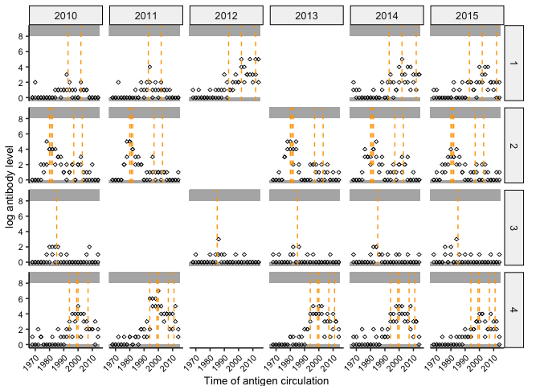

<!-- README.md is generated from README.Rmd. Please edit that file -->

# serosolver

[](https://www.repostatus.org/#active)

`serosolver` uses a hierarchical model with a custom Markov chain Monte
Carlo sampler to simultaneously infer antibody kinetics and infection
histories from cross-sectional or longitudinal serological data.
`serosolver` is a [time-since-infection serodynamics
model](https://osf.io/preprints/osf/kqdsn), meaning that infection times
are back-calculated from one or more antibody measurements through an
antibody kinetics model. `serosolver` can be used to infer infection
timings during a study period using longitudinal measurements against a
single antigen, or lifetime infection histories using multi-antigen
serology panels. The package and model are described by Hay *et al.*
[here](https://doi.org/10.1371/journal.pcbi.1007840).

## Recent changes

`serosolver` is back in active development to fix bugs, standardize
variable names and add new features.
<details>
<summary>
List of recent changes:
</summary>

- Overhaul of variable names (e.g., *titre* -\> *measurement*, *strain*
  -\> *biomarker_id*)
- Consolidation of plotting functions
- Moving more options and inputs behind the scenes to streamline the
  user interface
- Generalization to consider multiple biomarker types per sample (e.g.,
  antibody titre and avidity)
- Support for continuous as well as discrete observations (e.g., can now
  fit to ELISA data as well as HAI titres)
- *IN PROGRESS* Some small improvements to the MCMC sampler and
  parameter transformations
- *IN PROGRESS* Improved guidance and support for using priors
- *IN PROGRESS* Model infection histories and antibody kinetics as a
  function of demographic variables
- *IN PROGRESS* Allow some infection states to be fixed during fitting
- *IN PROGRESS* Inclusion of explicit immunity model
- *IN PROGRESS* Ways to fix or estimate starting/baseline titres
- *IN PROGRESS* Added tests

</details>

## Installation

1.  Install [R](http://cran.r-project.org)

2.  Install the development version of serosolver from
    [GitHub](https://github.com/seroanalytics/serosolver):

``` r
devtools::install_github("seroanalytics/serosolver")
library(serosolver)
```

## Quick start and vignettes

Read the [quick start
vignette](https://seroanalytics.github.io/serosolver/articles/serosolver-quick_start_guide.html)
to set up and run a simple implementation with a simulation model.

Additional vignettes:

- [Longitudinal
  data](https://seroanalytics.github.io/serosolver/articles/cs1_vignette.html):
  estimating infection timings using longitudinal data, example of
  influenza A/H1N1p in Hong Kong
- [Cross-sectional
  data](https://seroanalytics.github.io/serosolver/articles/cs2_vignette.html):
  estimating life-course infection histories from multi-strain serology,
  example of influenza A/H3N2 from the [Fluscape
  cohort](https://pubmed.ncbi.nlm.nih.gov/26875566/)
- 
- 
- 

## Example

This is a basic example of simulating some serological data and fitting
the model using the MCMC framework.

``` r
library(serosolver)
library(ggplot2)
library(plyr)
library(dplyr)
library(tidyr)
library(data.table)
library(doParallel)
library(coda)

## Load in example parameter values and antigenic map
data(example_par_tab)
data(example_antigenic_map)
data(example_antibody_data)
data(example_inf_hist)
```

``` r
plot_antibody_data(example_antibody_data,example_antigenic_map$inf_times,n_indivs=1:4,example_inf_hist)
```



``` r
## Run the MCMC
# This example uses prior version 2 (i.e. beta prior on phi with parameters shape1 and shape2)
output <- serosolver::serosolver(example_par_tab, example_antibody_data, example_antigenic_map,
                filename="readme", prior_version=2,n_chains=3,parallel=TRUE,
                mcmc_pars=c(adaptive_iterations=10000, iterations=50000),verbose=FALSE)
```

``` r
# Plot model predicted titres for a subset of individuals
chains <- load_mcmc_chains(location=getwd(),par_tab=example_par_tab,burnin = 10000,unfixed=TRUE)
plot_model_fits(chain = chains$theta_chain,
                infection_histories = chains$inf_chain,
                known_infection_history = example_inf_hist,
                antibody_data = example_antibody_data,individuals=1:4,
                antigenic_map=example_antigenic_map,
                par_tab=example_par_tab,
                orientation="cross-sectional")
```


