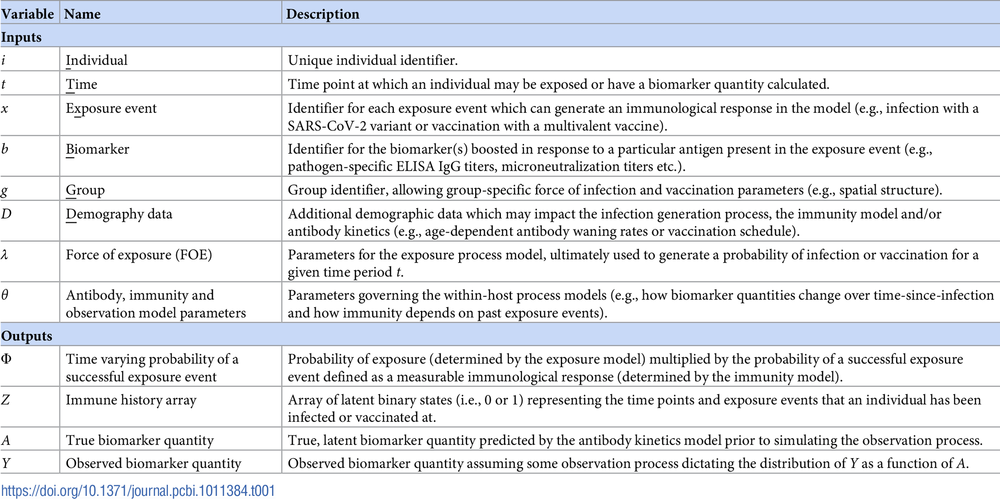

<!-- Modified by an AI assistant on 2026-09-17 using GPT-5. Corrected the
source attribution for the terminology figure. -->

# Key terminology

The names below are used throughout the package documentation. They describe
the main inputs, model quantities, and outputs rather than particular datasets.

| Name | Meaning |
|:-----|:--------|
| `individual` | Identifier for a person. IDs should normally run from 1 to `N` without gaps. |
| `sample_time` | Time at which an antibody measurement was taken. |
| `birth` | Birth time used to determine which exposure times an individual could have experienced. |
| `possible_exposure_times` | Times at which an infection or other exposure can occur in the model. |
| `biomarker_id` | Identifier for the antigen, strain, or other biomarker being measured. |
| `biomarker_group` | Identifier for a separate observation and antibody-kinetics model, such as titre or avidity. |
| `population_group` | Group used to apply different infection-history priors or summarise attack rates. |
| `measurement` | Observed antibody or other biomarker value. |
| `antibody_data` | Data frame containing the serological measurements and their identifiers and times. |
| `demographics` | Optional data frame containing fixed or time-varying demographic covariates. |
| `par_tab` | Model control table containing parameter values, bounds, fixed/estimated status, and related settings. |
| `inf_chain` | MCMC draws for the latent infection histories. |
| `theta_chain` | MCMC draws for antibody-kinetics, observation, and related model parameters. |

# Current and published terminology

The current interface uses the following names in place of the names used by
the published version of `serosolver`. The main change is from terminology
based on influenza titres and strains to terminology that also covers other
pathogens, assays, and biomarker types. See the [published package and model
description](https://doi.org/10.1371/journal.pcbi.1007840) for the original
notation and workflow.

| Current name | Published name | Meaning |
|:-------------|:---------------|:--------|
| `antibody_data` | `titre_dat` | Main long-format serological data frame. |
| `sample_time` | `samples` | Time at which a sample was taken. |
| `biomarker_id` | `virus` | Identifier for the antigen, strain, or biomarker being measured. |
| `measurement` | `titre` | Observed antibody or biomarker value. |
| `repeat_number` | `run` | Identifier for a repeated measurement of the same sample and biomarker. |
| `birth` | `DOB` | Birth time used when determining possible exposure times. |
| `population_group` | `group` | Group used for infection-history priors and attack-rate summaries. |
| `possible_exposure_times` | `strain_isolation_times` or `circulation_times` | Times at which an infection or exposure can occur. |
| `prior_version` | `version` | Infection-history prior version used by the model. |

`biomarker_group` and the separate `demographics` data frame are part of the
expanded current interface and do not have a single direct equivalent in the
published input table. They allow different observation types and fixed or
time-varying covariates to be represented explicitly.

The figure below is from the [`serosim`](https://journals.plos.org/ploscompbiol/article?id=10.1371/journal.pcbi.1011384)
paper. It gives the corresponding mathematical notation and includes some
additional model quantities. It is useful when comparing the current package
interface with the notation used in the published version of `serosolver`,
where some names and definitions differ.

```{r naming-convention-figure, echo=FALSE, out.width="100%", fig.cap="Key serosolver variable terminology and its relationship to the model notation."}

```
