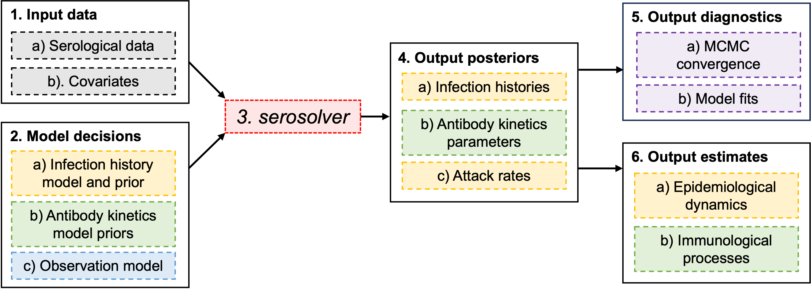

```{=html}
<!-- Modified by an AI assistant on 2026-09-17 using GPT-5. Updated worked
observation-model examples to use character data_type labels. -->
```

```{=html}
<!-- Modified by an AI assistant on 2026-09-16 using GPT-5. Added an example
of comparing observed measurements with predictions from posterior draws. -->
```

```{r setup, include = FALSE}
knitr::opts_chunk$set(
  collapse = TRUE,
  comment = "#>",
  fig.width = 8,
  fig.height = 6,
  dpi = 300,
  out.width = "100%"
)

options(digits = 3)
library(serosolver)
data(example_antibody_data)
data(example_par_tab)
data(example_antigenic_map)
par_tab <- example_par_tab
vignette_dir <- dirname(knitr::current_input())
loader_file <- file.path(vignette_dir, "..", "inst", "extdata",
                          "vignette_chain_loader.R")
if (!file.exists(loader_file)) {
  loader_file <- system.file("extdata", "vignette_chain_loader.R",
                             package = "serosolver")
}
source(loader_file)
guide_bundle <- load_vignette_chain_bundle(vignette_dir, "guide.rds")
if (!is.null(guide_bundle[["guide"]])) {
  mcmc_dir <- materialize_vignette_chain_fit(
    guide_bundle[["guide"]], tempfile("serosolver_guide_chains_"), "guide"
  )
} else {
  mcmc_dir <- file.path(vignette_dir, "..", "inst", "extdata", "guide")
  if (!dir.exists(mcmc_dir)) {
    mcmc_dir <- system.file("extdata", "guide", package = "serosolver")
  }
}
dir.create(mcmc_dir, recursive = TRUE, showWarnings = FALSE)
mcmc_file <- file.path(mcmc_dir, "guide")
```


## Overview {.unnumbered}

`serosolver` jointly infers antibody kinetics, infection histories and attack rates from cross-sectional or longitudinal serological data, originally described by Kucharski *et al.* @kucharski2018 and developed further by Hay *et al.* @hay2020 . `serosolver` exploits the predictability of antibody kinetics over time following exposure, using one or more antibody level measurements combined with an antibody kinetics model to back-calculate (i.e., extrapolate backwards) the timing of individual infections.

What distinguishes `serosolver` from other [time-since-infection models](https://doi.org/10.1016/j.epidem.2024.100806) is a) jointly inferring an antibody kinetics model and infection histories within the same framework; b) the ability to infer multiple infections per person; and c) supporting multi-antigen systems as well as single-antigen problems.

The core of the package is the `serosolver` function, which takes all of the data and model assumptions as inputs and saves Markov chain Monte Carlo (MCMC) outputs to disk. `serosolver` implements a flexible, hierarchical model, meaning that users must be aware of a number of model design decisions. In this vignette, we will show how longitudinal, multi-strain serological data can be cleaned for use in `serosolver`, and walk through the core functionality of the package and post-processing functions. It is a long vignette, but worth stepping through to make sure you understand how this fairly complex model works!

<br clear="right">

## Contents {.unnumbered}

This guide provides an overview of the key components for fitting a `serosolver` model. For more in depth instructions on specific features and detailed methods, see the case study vignettes. We will discuss the following workflow:

```{r fig1, echo=FALSE, fig.cap="Outline of the serosolver workflow", out.width = '100%'}

```

## Entire workflow

The following code runs the entire pipeline for a simulation-recovery experiment with `serosolver`. We will step through each of these sections in more detail in this guide.

```{r entire_simulation,echo=TRUE,eval=TRUE,results='hide',message=FALSE,warning=FALSE,fig.width=8,fig.height=6}
set.seed(123)

library(serosolver)
data(example_par_tab)
data(example_antigenic_map)

## Define a vector of all possible infection times
possible_exposure_times <- seq(2000,2024,by=1)

## Vector of antigens with observations, corresponding to times of circulation
sampled_antigens <- seq(min(possible_exposure_times), max(possible_exposure_times), by=2)

## Times at which serum samples can be taken from individuals
sampling_times <- 2020:2024

## Number of serum samples taken per person
n_samps <- 5

## Simulate some random attack rates
attack_rates <- simulate_attack_rates(possible_exposure_times)

## Use example antigenic map (can also be left as NULL)
antigenic_map <- example_antigenic_map[1:25,]
antigenic_map$inf_times <- possible_exposure_times

## Simulate a full serosurvey with these parameters
all_simulated_data <- simulate_data(par_tab=example_par_tab, group=1, n_indiv=100,
                                    possible_exposure_times=possible_exposure_times,
                                    measured_biomarker_ids = sampled_antigens,
                                    sampling_times=sampling_times, nsamps=n_samps,
                                    antigenic_map=antigenic_map,
                                    age_min=10,age_max=75,
                                    attack_rates=attack_rates, repeats=1,
                                    data_type="continuous")

## Pull out the simulated titre data and infection histories
antibody_data <- all_simulated_data$antibody_data
true_inf_hist <- all_simulated_data$infection_histories
plot_antibody_data(antibody_data,possible_exposure_times,1:4,infection_histories = true_inf_hist)

## MCMC settings used by the executable example
mcmc_pars <- c(adaptive_iterations=100000, iterations=200000,
               thin=10, thin_inf_hist=2000, save_block=1000)
```

```{r fit_model_call, eval=FALSE}
res <- serosolver(
  example_par_tab,
  antibody_data,
  antigenic_map = antigenic_map,
  filename = mcmc_file,
  n_chains = 3,
  parallel = TRUE,
  mcmc_pars = mcmc_pars,
  data_type="continuous"
)
```

```{r fit_model, echo=FALSE, results='hide', message=FALSE, warning=FALSE}
settings_file <- paste0(mcmc_file, "_serosolver_settings.RData")
chain_files <- list.files(
  mcmc_dir,
  pattern = paste0("^", basename(mcmc_file), "_[0-9]+_chain\\.csv$"),
  full.names = TRUE
)
infection_history_files <- sub(
  "_chain\\.csv$", "_infection_histories.csv", chain_files
)
chains_available <- length(chain_files) > 0L &&
  file.exists(settings_file) &&
  all(file.exists(infection_history_files))

if (!chains_available) {
  res <- serosolver(
    example_par_tab,
    antibody_data,
    antigenic_map = antigenic_map,
    filename = mcmc_file,
    n_chains = 3,
    parallel = TRUE,
    mcmc_pars = mcmc_pars,
    verbose = FALSE,
    data_type="continuous"
  )
} else {
  load(settings_file)
  chains <- load_mcmc_chains(
    location = mcmc_dir,
    par_tab = example_par_tab,
    burnin = mcmc_pars[["adaptive_iterations"]],
    thin = mcmc_pars[["thin"]],
    convert_mcmc = FALSE,
    verbose = FALSE
  )
  all_diagnostics <- plot_mcmc_diagnostics(
    location = mcmc_dir,
    par_tab = example_par_tab,
    burnin = mcmc_pars[["adaptive_iterations"]]
  )
  res <- list(
    all_diagnostics = all_diagnostics,
    settings = serosolver_settings,
    plot_fits_cross_sectional = plot_model_fits(
      chains$theta_chain,
      chains$inf_chain,
      individuals = 1:5,
      settings = serosolver_settings,
      orientation = "cross-sectional",
      expand_to_all_times = FALSE,
      expand_to_all_biomarker_ids = TRUE,
      data_type="continuous"
    ),
    plot_attack_rates = plot_attack_rates(
      chains$inf_chain,
      settings = serosolver_settings,
      by_group = TRUE,
      plot_den = FALSE
    ),
    plot_antibody_model = plot_estimated_antibody_model(
      chains$theta_chain,
      settings = serosolver_settings,
      solve_times = serosolver_settings$possible_exposure_times
    ),
    mcmc_chains = chains
  )
}

serosolver_settings <- res$settings
chains <- res$mcmc_chains
```

## Installation and dependencies

Install `serosolver` using the `remotes` package:

```{r,eval=FALSE}
remotes::install_github("seroanalytics/serosolver")
```

Note, that `serosolver` uses `Rcpp` code, including `RcppArmadillo`. You will therefore need a working C++ compiler such as `clang` or `gcc`. The easiest way to set this up is up for Windows users is the [`Rtools`](https://cran.r-project.org/bin/windows/Rtools/rtools43/rtools.html) package. For Mac users, you will need to install a compiler such as [`Xcode`](https://mac.r-project.org/tools/) or [`clang`](https://cran.r-project.org/bin/macosx/tools/).

The required and additional packages can be installed from CRAN using:

```{r, eval=FALSE}
required_packages <- c(
  "data.table", "ggplot2", "dplyr", "tidyr", "Rcpp", "coda",
  "doParallel", "doRNG", "foreach", "Matrix", "MASS", "reshape2",
  "tibble", "RcppArmadillo", "RcppParallel"
)

additional_packages <- c(
  "remotes", "devtools", "plyr", "tidyverse"
)

install.packages(c(required_packages, additional_packages))
```

## Input data

`serosolver` expects several inputs, including the serological data, a data frame controlling the model parameters (`par_tab`), an antigenic map or vector of possible exposure times (`antigenic_map` or `possible_exposure_times`), and optionally a data frame of demographic data (`demographics`). This section will walk the users through creating each of these inputs.

### Serological data

`serosolver` expects a data frame of serological data in long format (i.e., there is a row for each observation), referred to as `antibody_data` in most function arguments, giving the individual ID, sample time, biomarkers or antigens measured, serological measurement, and demographic information:

```{r, eval=TRUE}
data(example_antibody_data)
knitr::kable(head(example_antibody_data))
```

[**Key point:** all variables in `serosolver` are indexed from 1, matching `R` coding style rather than `C++`.]{.underline}

Description of variables:

1.  `individual`: *consecutive* integer ID of individuals from $1,\dots,N$, where $N$ is the number of individuals in the sample.
2.  `sample_time`: integer value of the time period in which a sample was collected i.e., the observation time.
3.  `biomarker_id`: integer ID of the measured biomarker or antigen, matching entries in `antigenic_map`.
4.  `biomarker_group`: optional, integer ID of the measurement type. Set this to 1 when all measurements are the same kind. Use different numbers when each sample contains different kinds of measurements, such as an antibody titre and an avidity measurement.
5.  `measurement`: the measurement for this `individual` against `biomarker_id` at `sample_time` i.e., the observation.
6.  `repeat_number`: integer value starting from 1 where repeat measurements are available per sample and `biomarker_id` combination.
7.  `population_group`: integer ID separating individuals within a sample into different groups (explained below).
8.  `birth`: integer value giving the time period (matching the supported range of `sample_time`) in which an individual was born i.e., the date of birth.

Data can be cross-sectional samples with multiple biomarkers measured per sample (e.g., multiple influenza strains), such that different `biomarker_id`s correspond to different time periods, or longitudinal samples with one or more biomarkers measured per sample (e.g., measuring measles IgG titers over time).

Use `check_data()` to check that the required columns and values are present before fitting a model. The examples in this guide use the supplied `example_antibody_data` dataset.

Serological data should be inspected before fitting with:

```{r, eval=TRUE, fig.width=6,fig.height=4,fig.cap="Cross-sectional serology against multiple antigens from multiple serum samples. Plot columns give time periods of sample times, rows give individuals. X-axis gives the time each biomarker ID was assumed to be circulating."}
plot_antibody_data(example_antibody_data,example_antigenic_map$inf_times,n_indivs=1:3,study_design = "cross-sectional")
```

```{r, eval=TRUE, fig.width=6,fig.height=2.5,fig.cap="Longitudinal serology against multiple antigens from multiple serum samples. Plot columns give individuals, rows give biomarker groups (not biomarker IDs!). Points are coloured by biomarker ID. X-axis gives time of sample collection."}
plot_antibody_data(dplyr::filter(example_antibody_data, biomarker_id %in% c(1968,2004,2012)),2010:2015,n_indivs=1:3,study_design = "longitudinal")
```

### Antigenic map

`serosolver` was designed to treat `biomarker_id` as interchangeable with the time variables, such that one antigen ID is assumed to circulate in one time period. For example, `biomarker_id=1968` refers to the antigen assumed to be circulating in 1968. Note that at present, `serosolver` supports only one antigen/biomarker per time period. However, a single `biomarker_id` can be assumed to circulate and dominate for multiple time periods, which can be specified by modifying the `antigenic_map` object.

The `antigenic_map` object tells `serosolver` how different `biomarker_id`s are antigenically related to each other (using coordinates on an antigenic map), as well as the time periods during which the `biomarker_id` is assumed to be circulating. Antigenic maps are commonly used to quantitatively represent antigenic relationships between antigenically variable pathogens @smith2004. Setting all antigenic coordinates to the same values tells `serosolver` that there are no antigenic differences between `biomarker_id`s (i.e., no antigenic variation). The same thing can be achieved by setting `antigenic_map=NULL` and instead specifying the `possible_exposure_times` vector.

```{r, eval=TRUE}
## Example antigenic map
data(example_antigenic_map)
knitr::kable(head(example_antigenic_map))
```

```{r,eval=FALSE}
## Antigenic map with no antigenic variation
data.frame(x_coord=1,y_coord=1,inf_times=1:10)

## Antigenic map with clusters, each one circulated for 3 time units
data.frame(x_coord = rep(seq(1,3,by=1),each=3), y_coord=rep(seq(1,3,by=1),each=3),inf_times=1:9)

## Antigenic map with two biomarker groups
data.frame(x_coord=1,y_coord=1,inf_times=rep(1:10,2),biomarker_group=rep(c(1,2),each=10))
```

### Covariate data {#covariates}

Individuals can't be infected before they're born, and we can't infer infections which occurred after the final sample from each individual. `serosolver` uses the `birth` and `sample_time` variables to constrain when and which `biomarker_id`s an individual can have been infected by.

The `population_group` variable is used to split individuals into groups under different infection rates. These might represent different geographic groups or demographic groups. For example, we might be interested in comparing attack rates and infection histories between two locations with very different epidemiological dynamics. In this case, we shouldn't assume that all individuals are under the same force of infection, and thus we need to tell `serosolver` to account for this difference in two places:

```{r, eval=FALSE}
## Set individual 1:25 to population_group 1, and individual IDs >25 to population_group 2
antibody_data <- antibody_data %>% mutate(population_group=if_else(individual <= 25, 1, 2))

par_tab[par_tab$names %in% c("infection_model_prior_shape1","infection_model_prior_shape2"),"stratification"] <- "population_group"
```

For most simple models, this variable can be ignored or set to 1 for all individuals and `par_tab$stratification` can be left as `NA`.

Similar logic can be applied to stratify the antibody kinetics by one or more covariates. For example, we might want to test if antibody titres wane quicker in certain age groups. The general approach is similar to `population_group`:

```{r, eval=FALSE}
## Split into two age groups based on whether the individual was born on or before 1990 or after
antibody_data <- antibody_data %>% mutate(age_group=if_else(birth <= 1990, 1, 2))

## Tell serosolver to stratify the wane_short parameter by age_group
par_tab[par_tab$names == "wane_short","stratification"] <- "age_group"
```

There are a few ways the user can implement this depending on their desired model (e.g., should covariates be static over the study period or change with e.g., age?). Demographic information can be supplied in a separate dataset. Covariates can be static, such as sex or location, or can change over time, such as age group or vaccination status. Multiple covariates can also be combined when defining groups, allowing the model to compare infection rates or antibody kinetics across more detailed demographic categories. These features are explained in the [demographic variables and covariates vignette](demographics_covariates.html).

`serosolver` can also estimate different antibody kinetics for different variants or strains that circulated at different times. This follows a slightly different workflow, because the grouping is linked to the infection or exposure variant rather than directly to the individual, and is also explained in the [demographic variables and covariates vignette](demographics_covariates.html).

### The parameter table (`par_tab`)

`par_tab` is the model control object. It contains one row for each model parameter and tells `serosolver` which values to use, which values to estimate, and the allowed ranges.

The main columns are:

1.  `names`: the parameter names used by the model.
2.  `values`: the parameter value supplied to the model. This is used as the starting value when `random_start_parameters = FALSE` in the `serosolver` function call; otherwise, estimated parameters start with values generated using `lower_start` and `upper_start`.
3.  `fixed`: set to `1` to keep a parameter fixed, or `0` to estimate it during the MCMC run.
4.  `lower_bound` and `upper_bound`: the lowest and highest values allowed during model fitting.
5.  `lower_start` and `upper_start`: the range used when generating random starting values for estimated parameters. You can tighten these bounds to ensure `serosolver` starts with plausible parameter values.
6.  `stratification`: the name of a column used when a parameter should vary between groups. Leave this as `NA` when no groups are needed.
7.  `biomarker_group`: identifies which type of measurement the parameter belongs to. This should match the values in `antibody_data`.

The optional `steps` column controls the initial proposal step size for an estimated parameter. The infection-history prior also requires parameters named `infection_model_prior_shape1` and `infection_model_prior_shape2`. There is also the `par_type`, variable, which is an internal label used to organise model parameters, such as antibody parameters, infection-history parameters, and measurement offsets. This can be ignored by the user.

The supplied example shows the expected structure:

```{r, eval=FALSE}
data(example_par_tab)
knitr::kable(example_par_tab)

## Check the table before fitting
checked_par_tab <- check_par_tab(example_par_tab)
```

Parameters can be changed by selecting their names. For example, this fixes the short-term waning parameter at `0.25`:

```{r, eval=FALSE}
par_tab[par_tab$names == "wane_short", "values"] <- 0.25
par_tab[par_tab$names == "wane_short", "fixed"] <- 1
```

## Model decisions

Before fitting a model, think about the timescale and range of infection times that you would like to estimate and the features of the antibody kinetics model you'd like to fit. These choices determine how `serosolver` interprets the dataset and the resulting estimates. In particular, make sure that all time variables use the same reference and resolution, and that assay limits and measurement types are correctly represented in `par_tab`.

### Infection history model and priors

One of the most confusing model design decision in `serosolver` is setting the infection history model. First, we need to understand the epidemiological question we seek to address. If our main objective is to estimate attack rates, we need to think about the power/information we have to estimate attack rates and infection histories at a chosen time resolution (e.g., annual attack rates or per month). If instead our main objective is to understand antibody kinetics, we might wish to simplify the infection history model to allow a more complex antibody kinetics model. The rationale is the same as any other statistical model: practical parameter identifiability is limited by the data, and thus we should choose as simple a model structure as possible to answer our question.

#### Model time resolution

It is possible to estimate infection states just for the duration of the serostudy, or to estimate infection histories for an arbitrary number of time periods prior to the study. For example, we might use serosolver to estimate infections that occurred between two serum sample collection times in the same way we would measure seroconversion rates. Alternatively, we might only have serum samples for recent time periods, but aim to estimate infection histories all the way back to the time of birth.

All time variables in a `serosolver` model must be at the same time resolution, including `sample_time`, `biomarker_id`, `birth`, and `possible_exposure_times`. This can cause confusion, as these variables must be integers, and thus we have to do some transformation before running `serosolver`:

- For annual samples, the sample time is simply the year each sample was collected in. For example, data collected between 2009 and 2011 would simply have values of 2009, 2010, or 2011.

- For semi-annual samples, the sample time is the year the sample was collected multiplied by 2 (since there are two time periods in each year). For example, data collected between 2009 and 2011 would have values of $(2009 \times 2) + 1 = 4019$, $(2009.5 \times 2) + 1 = 4020$, $(2010 \times 2) + 1 = 4021$, $(2010.5 \times 2) + 1 = 4022$, $(2011 \times 2) + 1 = 4023$, $(2011.5 \times 2) + 1 = 4024$.

- Similarly, for quarterly or monthly samples, the sample time follows the same pattern. For example for a sample collected in July of 2009, the quarterly sample time would be $(2009 + \frac{3}{4})\times 4 + 1 = 8040$ (because July is in the third quarter of the year) and the monthly sample time would be $(2009 + \frac{7}{12})\times12 + 1 = 24116$ (because July is the seventh month).

`serosolver` estimates an infection state for each element of the vector `possible_exposure_times`, which is either passed directly or extracted automatically from `antigenic_map$inf_times`. The range and entries of these vectors therefore determines the model time period and resolution of the infection history model. If `antigenic_map` is specified, then you can typically leave `possible_exposure_times` as `NULL`. If you aren't using an antigenic map, then you must specify `possible_exposure_times`.

```{r,eval=FALSE}
## possible_exposure_times is used in multiple places to tell serosolver the vector of times at which individuals might be infected
possible_exposure_times <- seq(2000,2025,by=1) ## Annual infection states
possible_exposure_times <- seq(2000*4, 2025*4,by=1) ## Quarterly infection states

## antigenic_map contains the same information as possible_exposure_times in its inf_times variable
possible_exposure_times <- antigenic_map$inf_times
```

A useful feature of `serosolver` is to use *mixed* time resolutions. For example, we might estimate infection histories at an annual resolution up to 2009, and then at a per-quarter resolution thereafter. Another example might be to estimate per-cluster infections for historic periods of time to establish long-term infection histories, and then per-quarter or per-year infection histories during the study period to model shorter-term dynamics. This can be useful for reducing parameter space when we have limited information to draw inferences about particular time periods, but rich information for others:

```{r,eval=FALSE}
## Infection states every 4 years up to 2020, then yearly
possible_exposure_times <- c(seq(1990, 2019,by=4), seq(2020,2025,by=1))
```

#### Infection history priors

A very important consideration, but one which is highly technical and unimportant for most users, is the structure of the prior to place on the individual infection histories. Most of the supplementary material of the main [publication](https://pubmed.ncbi.nlm.nih.gov/32365062/) is about this decision.

For most users, the only thing you need to consider is the prior you wish to place on the per-time probability of infection. As individual infection states are modeled as Bernoulli variables (i.e., they can be 0 or 1), an appropriate prior for the per-time probability of infection is a Beta distribution. Thus, by changing the shape parameters of this Beta distribution, we can change the prior on the infection states. For example, we might want to use uninformative priors by setting both shape parameters to 1. Alternatively, we might have some prior understanding of the probability of infection in each time period — if we think the annual attack rate is around 5%, we might set the Beta distribution shape parameters to 0.5 and 10 (which would give a mean prior attack rate of 5%); try `hist(rbeta(1000, 0.5, 10))`.

Note that `serosolver` assumes the same Beta prior applies to all individuals and all time periods by default, so choose your Beta parameters carefully. However, it is possible to use a separate Beta prior for different population groups, for example, if you want to model the fact that individuals in different locations are under independent forces of infection. This is referenced in [1.3 Covariate data](#covariates) and illustrated in the case study guides.

It is possible to assume different priors for the infection history model, but this is complex and not necessary for most use cases. You can read more about the different priors in the main [publication](https://pubmed.ncbi.nlm.nih.gov/32365062/), and if you really know what you're doing you can change the prior model with the `prior_version` argument of the main `serosolver` function.

### Antibody kinetics model and priors

`serosolver` models antibody measurements as arising from antibody responses following one or more infections. Users can specify the size and timing of short- and long-term boosts, antibody waning, antigenic seniority, and cross-reactivity between biomarkers using an antigenic map. The model is described fully in the main [publication](https://pubmed.ncbi.nlm.nih.gov/32365062/). In the parameter file, the column `fixed` indicates if each parameter value is fixed (`fixed=1`) or should be estimated (`fixed=0`). A brief summary of each model level is described here.

You can inspect the assumed antibody kinetics model using the `plot_antibody_model` function along with `par_tab`, the antigenic map, and a chosen infection history. For example, the current assumed antibody kinetics model using the example antigenic map and assuming a single infection in 1975 produces longitudinal antibody kinetics and antibody landscapes which look like this:

```{r,echo=FALSE}
plot_antibody_model(
  pars = example_par_tab,
  infection_history = 1975,
  antigenic_map = example_antigenic_map,
  times = example_antigenic_map$inf_times[1:25]
)
```

The first plot shows the modelled antibody level over time (on the x-axis) stratified by each biomarker ID in the antigenic map. The second plot shows the antibody landscape at each sample time (as facets) with biomarker ID on the x-axis.

#### Boosting

Following infection, `serosolver` assumes that an individual's antibody level against the infecting strain/variant increases by $\mu_{long} + \mu_{short}$, coded as `boost_short + boost_long` units over `boost_delay` time units. Note that `boost_delay` should be in integer units matching the timescale of the model. Estimating `boost_short` and `boost_long` jointly may be challenging without sufficient data, particularly longitudinal data to distinguish a short-term, transient response from the long-term, persistent response. Users may therefore wish to fix one of these parameters either at a known value or at 0.

```{r, echo=FALSE,eval=FALSE}
## Fix boost_short at 0 and only estimate long-term boosting
par_tab[par_tab$names == "boost_short","fixed"] <- 1
par_tab[par_tab$names == "boost_short","values"] <- 0
```

#### Waning

Both the short- and long-term boosts can be set to wane over time. These rates are set by $\omega_{short}$ and $\omega_{long}$, coded as `wane_short` and `wane_long` respectively. In practice, we have found it difficult to identify both waning rates, and usually fix `wane_long` at 0. Note that this parameter is not an exponential (on the natural scale) waning rate parameter by default: it describes the proportion of the boost lost per time unit since infection, $t$:

$$
W(t)=\max\{0,1-\omega t\}
$$

Alternatively, users can model waning as exponential decay *on the log scale* (so exponential-on-exponential on the natural scale). Add a fixed model-option row named `exponential_waning` to `par_tab`, with `values = 1` and `par_type = 0`:

$$
W(t) = e^{-\omega t}
$$

Note that this setting also changes the cross-reactivity model below. The rationale behind these waning models is described in this [publication](https://doi.org/10.64898/2026.04.16.26351029).

```{r}
exponential_par_tab <- example_par_tab
exponential_par_tab$values[exponential_par_tab$names == "exponential_waning"] <- 1

plot_antibody_model(
  pars = exponential_par_tab,
  infection_history = 1975,
  antigenic_map = example_antigenic_map,
  times = example_antigenic_map$inf_times[1:25]
)[[1]]
```

If the `exponential_waning` row is absent, or its `values` entry is 0, the model uses linear waning and the waning parameters should be bounded between 0 and 1. With `values = 1`, the waning parameters should be positively bounded. The old `exponential_waning` argument remains available for compatibility but is deprecated; the `par_tab` row takes precedence when both are supplied.

#### Cross-reactivity

Cross-reactivity between biomarker IDs is modelled using the antigenic map input. Separate cross-reactivity parameters are used for the short- and long-term boosts, usually because short-term boosting is antigenically broader than the long-term boost. Cross-reactivity is modelled as a declining boost with increasing antigenic distance from the infecting strain: the degree of boosting to the infecting strain, $x$, is just `boost_long+boost_short`, but for heterologous strains, $y$, this declines as a linear function of antigenic distance such that the degree of boosting of antibody levels to strain $y$ given infection with strain $x$ is:

$$
B_{x,y}=\mu_{long} \text{max}\{0,1-\sigma_{long} \delta_{x,y}\} + \mu_{short} \text{max}\{0,1-\sigma_{short}\delta_{x,y}\} $$ where $\sigma_{long}$ and $\sigma_{short}$ correspond to `cr_long` and `cr_short` in `par_tab` respectively, and $\delta_{x,y}$ is the Euclidean distance between strain $x$ and strain $y$ calculated from the antigenic map directly.

As with the waning model, cross-reactivity can instead be assumed to decline exponentially rather than linearly with antigenic distance as:

$$
B_{x,y}=\mu_{long}e^{-\sigma_{long} \delta_{x,y}} + \mu_{short}e^{-\sigma_{short} \delta_{x,y}} $$

If the linear form is used, the cross-reactivity parameters should be bounded between 0 and 1. With the exponential form selected in `par_tab`, the cross-reactivity parameters should be positively bounded.

If fixing either the long-term or short-term boosting arms to 0, then it is recommended to also fix the corresponding cross-reactivity parameters at 0.

#### Antigenic seniority

`serosolver` can model the overall level of antibody boosting to decline with each successive infection using the antigenic seniority parameter, $\tau$, or `antigenic_seniority`. Antigenic seniority is modelled here as a simple phenomenological effect and thus we caution against overinterpretation. It simply suppresses each successive boost as a function of the number of prior infections as:

$$
S(k) = \text{max}\{0, 1-\tau(k-1)\}
$$

where $k-1$ gives the number of infections prior to the current one. Thus, the first infection has $S_{1}=1$, the second has $S(2)=\text{max}\{0, 1-\tau\}$, and the third has $S(3)=\text{max}\{0, 1-2\tau\}$, etc. Setting $\tau=0$ means that there is no reduction. This model stems from the paper by [Kucharski et al](https://doi.org/10.1371/journal.pbio.1002082) and should not be over-interpreted as mechanistically representing antigenic seniority, back-boosting, or antibody ceiling effects.

### Observation model

Most applications of `serosolver` involve fitting to antibody titre or concentration data. The model asumes that observations are distributed around some true value predicted by the model i.e., it accounts for observation noise.

`serosolver` accommodates both continuous and discrete data, and accounts for the upper and lower limits of detection of the assay. Continuous data can take values across a range, whereas discrete data take separate values such as integer titre categories. These limits and the measurement type will need to be specified in the model using the `par_tab` object. `serosolver` also supports multiple measurement types per sample, for example, measuring both antibody titre and avidity (see the [advanced features vignette](advanced_features.html)). These observation types are distinguished by the `biomarker_group` variable -- all observations within a `biomarker_group` are underpinned by their own antibody kinetics model parameters, but arising from the same individual-level infection histories.

The following inputs should be updated depending on the limits of detection of the assay used and whether the data are continuous or discrete:

```{r,eval=FALSE}
## Example of two biomarker_groups, one has discrete data one has continuous data
## Set bounds of the assay
par_tab[par_tab$names=="min_measurement" & par_tab$biomarker_group == 1,"values"] <- 0
par_tab[par_tab$names=="max_measurement" & par_tab$biomarker_group == 1,"values"] <- 10

par_tab[par_tab$names=="min_measurement" & par_tab$biomarker_group == 2,"values"] <- 1
par_tab[par_tab$names=="max_measurement" & par_tab$biomarker_group == 2,"values"] <- 8

## Set observation type: discrete, continuous, or continuous with false positives
data_type <- c("discrete", "continuous", "false_positive") ## used in `serosolver::serosolver`, `serosolver::simulate_data` etc
```

### Priors

The prior distributions should be checked before fitting the model. This is useful for checking that the model gives reasonable weight to the infection histories, attack rates, and antibody kinetics that you consider plausible.

#### Fixed and estimated parameters

The `fixed` column in `par_tab` controls whether a value is kept fixed or estimated by MCMC. Set `fixed = 1` when a value is known or is being held at a chosen value, and set `fixed = 0` when the value should be estimated. Fixed values do not have posterior uncertainty. For an estimated parameter, `values` is the starting value when `random_start_parameters = FALSE`; when random starting values are used, `lower_start` and `upper_start` are used to generate the starting value.

For example, this fixes the short-term waning parameter at `0.25`:

```{r, eval=FALSE}
par_tab[par_tab$names == "wane_short", "values"] <- 0.25
par_tab[par_tab$names == "wane_short", "fixed"] <- 1
```

#### Bounds in `par_tab`

`lower_bound` and `upper_bound` are hard limits for an estimated parameter. MCMC proposals outside these limits are not accepted. They therefore restrict the range over which a prior can put weight, but they are not prior means or standard deviations. The `lower_start` and `upper_start` columns only control random starting values and do not define the prior.

The bounds should match the parameter scale. For example, a probability is usually bounded between 0 and 1, while a positive antibody boost can have a lower bound of 0 and a larger upper bound. The bounds also determine the transformation used internally for many parameters, so they should be set before fitting and checked with `check_par_tab()`.

#### Antibody-kinetics parameter priors

The `prior_func` argument can be used to specify prior distributions for the antibody-kinetics parameters. It is an outer function that receives `par_tab` once and returns a function that receives the current parameter values during the MCMC run. The returned function should return one log-prior value, usually by adding the log densities for the parameters to which priors have been assigned.

For example, the following uses log-normal priors for positive parameters and a Beta prior for a parameter bounded between 0 and 1:

```{r, eval=FALSE}
prior_func <- function(par_tab) {
  par_names <- as.character(par_tab$names)
  boost_long <- which(par_names == "boost_long")
  boost_short <- which(par_names == "boost_short")
  wane_short <- which(par_names == "wane_short")
  obs_sd <- which(par_names == "obs_sd")

  function(pars) {
    names(pars) <- par_names
    sum(
      dlnorm(pars[boost_long], log(2), 0.5, log = TRUE),
      dlnorm(pars[boost_short], log(2), 0.5, log = TRUE),
      dbeta(pars[wane_short], 4, 8, log = TRUE),
      dlnorm(pars[obs_sd], log(1), 0.5, log = TRUE)
    )
  }
}
```

The function is passed to `serosolver(prior_func = prior_func)`. If a parameter is stratified, include every generated coefficient row in the prior function; this is illustrated in the [demographic variables and covariates vignette](demographics_covariates.html).

#### Infection-history shape priors

For most users, the prior on the per-time probability of infection is defined by the two rows named `infection_model_prior_shape1` and `infection_model_prior_shape2`. If these values are $\alpha$ and $\beta$, the per-time infection probability has a Beta distribution:

$$
p_t \sim \operatorname{Beta}(\alpha, \beta), \qquad
E[p_t] = \frac{\alpha}{\alpha + \beta}.
$$

The sum $\alpha + \beta$ controls how concentrated the prior is around its mean. For example, `alpha = 0.5` and `beta = 10` gives a prior with mean about 5% and places substantial weight near low probabilities. The same Beta prior is applied across people and exposure times unless it is stratified by `population_group` or another demographic variable.

The corresponding prior can be inspected with `rbeta()`:

```{r, eval=TRUE,fig.height=4,fig.width=6}
prior_attack_rate <- rbeta(10000, 0.5, 10)
hist(prior_attack_rate, breaks = 50,
     main = "Prior attack rate", xlab = "Per-time probability of infection")
```

Under the default prior version 2, the attack rates shown after fitting are calculated from the inferred infection histories. They are therefore realised sample proportions implied by those histories, rather than direct draws of the Beta parameters. Prior version 1 instead estimates a separate `phi` for each exposure time; this distinction is demonstrated in the [advanced features vignette](advanced_features.html).

#### Sampling from the priors

Set `solve_likelihood = FALSE` to run the MCMC without using the antibody observations in the likelihood. This samples from the specified parameter and infection-history priors, allowing prior predictive checks before fitting the data. The resulting chains can be inspected with the usual plotting and summary functions, for example:

```{r, eval=FALSE}
prior_fit <- serosolver(
  par_tab = par_tab, antibody_data = antibody_data,
  antigenic_map = example_antigenic_map,
  possible_exposure_times = possible_exposure_times,
  prior_func = prior_func, solve_likelihood = FALSE,
  filename = "prior_predictive", n_chains = 3,
  parallel = TRUE, mcmc_pars = mcmc_pars
)

plot_attack_rates(
  prior_fit$mcmc_chains$inf_chain,
  settings = prior_fit$settings
)
```

This separates the assumptions made before seeing the data from the posterior results obtained after the likelihood is included.

### Advanced features

`serosolver` has a number of advanced features for greater control over the model assumptions and inputs. Users can fix selected infection states, provide starting antibody levels, include measurement offsets (for systematic measurement biases), use exponential rather than linear antibody waning, and fit multiple biomarker groups such as antibody titre and avidity together.

These features require additional data preparation and model decisions. They are explained in detail in the [advanced features vignette](advanced_features.html) and the relevant case-study material.

## Running *serosolver*

After much data cleaning and model decision making, you are ready to pass your data and model inputs into `serosolver`. The main `serosolver()` function runs a custom, adaptive Metropolis-Within-Gibbs algorithm to sample from the posterior distribution for the model parameters given the input data. In other words, it estimates the antibody kinetics model parameters and infection histories in a Bayesian framework. Attack rates are calculated from these infection-history draws. The function saves the draws to files and returns a list containing the saved-file locations, model settings, diagnostics, and plots when these are requested.

Using the default options, the `serosolver` can be run using:

```{r, eval=FALSE}
res <- serosolver(par_tab = par_tab, antibody_data = antibody_data, antigenic_map = antigenic_map)
```

Users should modify the `mcmc_pars` argument to make adjustments for run time, convergence, and MCMC chain storage. This will mainly come down to increasing or decreasing the number of iterations and the adaptive period, though there are a number of fine-tuning inputs described in the details of `?serosolver`.

```{r, eval=FALSE}
mcmc_pars <- c("iterations"=50000,"target_acceptance_rate_theta"=0.44,"target_acceptance_rate_inf_hist"=0.44,
              "adaptive_frequency"=1000,"thin"=1,
              "adaptive_iterations"=10000, "save_block"=1000,
              "thin_inf_hist"=100, "proposal_inf_hist_indiv_prop"=0.5,
              "proposal_ratio"=2, "proposal_inf_hist_time_prop"=0.5,
              "proposal_inf_hist_distance"=5, "proposal_inf_hist_adaptive"=0,
              "proposal_inf_hist_indiv_swap_ratio"=0.5,"proposal_inf_hist_group_swap_ratio"=0.5,
              "proposal_inf_hist_group_swap_prop"=0.5)
res <- serosolver(par_tab = start_tab, titre_dat = titre_dat, antigenic_map = antigenic_map,
              mcmc_pars = mcmc_pars,data_type="continuous")
```

MCMC output is written to files automatically. The `filename` argument provides the prefix of the file names; `_chain.csv` and `_infection_histories.csv` are appended for the parameter and infection-history chain files. When multiple chains are run in parallel, progress messages are written to a matching `_log.txt` file in the same directory. A settings file is also saved alongside the chains to easily read back in all of the model inputs and settings.

The vignette uses saved chain output when it is available, so normal builds do not rerun the MCMC. If the saved output is absent, knitting the complete guide runs the model and may take several minutes.

To read the saved chains and `serosolver_settings` back into R, point `load_mcmc_chains()` to the directory containing the files:

```{r, eval=FALSE,results='hide',message=FALSE,warning=FALSE}
chains <- load_mcmc_chains(
  location = mcmc_dir,
  par_tab = example_par_tab,
  burnin = 500,
  thin = 1,
  convert_mcmc = TRUE
)
## Load the input settings
load(paste0(mcmc_file, "_serosolver_settings.RData"))
```

## Output posteriors {#output-posteriors}

`serosolver` generates numerous plots to visualise results and evaluate model performance. The vast majority of these are generated automatically by the `serosolver()` function as part of the return object. A few examples are shown below, but take a look at all of the objects in the list returned by `serosolver()`:

```{r, eval=TRUE, fig.cap="Model fits to the first 5 individuals, plotted as cross-sectional data. Each column depicts a sample time, each row depicts an individual. The x-axis shows the biomarker_id corresponding to the antigenic map. Black diamonds show observations, green lines/shaded regions show posterior median/95% credible intervals/95% prediction intervals. Orange bars show the inferred infection times -- darker orange denotes greater posterior probability."}
print(res$plot_fits_cross_sectional[[1]])
```

```{r, eval=TRUE, fig.cap="Estimated population attack rates over time. The facet shows population_group. X-axis shows time, and the y-axis shows the per-capita attack rate per time unit. Pointrange plots show posterior medians and 95% CrI. Note that the time periods are coloured by whether or not observations were made in that time period (i.e., older time periods are informed by back-calculating historic infections).",fig.height=5,fig.width=7}
print(res$plot_attack_rates)
```

```{r, eval=TRUE, fig.cap="Estimated antibody kinetics model over time-since-infection. The lines/shaded regions show posterior median/95% CrI estimates. The facets are used to group estimates by biomarker_group and covariate group (universal groups in this example). In this example, each colour represents a different biomarker ID, and the example assumes a single infection at t=2000 (i.e., the plot shows cross-reactive boosting and waning).",fig.height=5,fig.width=7}
print(res$plot_antibody_model)
```

These plots are generated automatically by `serosolver()`, but they can also be reproduced manually from the saved chains. This is useful when you want to change the number of plotted individuals, samples, burn-in, or other plotting options without rerunning the model. The chains and settings loaded in Section 3 are used in the following examples:

Further details about MCMC settings, including `save_block` and `thin_inf_hist`, are available in the [`serosolver` help file](https://seroanalytics.github.io/serosolver/reference/serosolver.html). The [`load_mcmc_chains()` help file](https://seroanalytics.github.io/serosolver/reference/load_mcmc_chains.html) describes the returned chain objects.

The same plotting functions used internally by `serosolver()` can be called directly:

```{r, eval=FALSE}
plot_model_fits(
  chains$theta_chain, chains$inf_chain,
  settings = serosolver_settings,
  individuals = 1:5,
  orientation = "cross-sectional"
)
```

```{r,eval=FALSE, warning=FALSE}
plot_attack_rates(chains$inf_chain, settings = serosolver_settings)
```

```{r,eval=FALSE}
plot_estimated_antibody_model(
  chains$theta_chain,
  settings = serosolver_settings,
  solve_times = serosolver_settings$possible_exposure_times
)
```

To compare the observed measurements with predictions from individual posterior draws, use `plot_antibody_predictions()`. The `p_hist_draws` plot shows the observations alongside a random selection of posterior draws, with a separate facet for each draw. This gives a visual check of the variation represented by the fitted observation model, rather than only showing the posterior median.

```{r, eval=TRUE, fig.cap="Observed antibody measurements compared with predictions from randomly selected posterior draws.", fig.height=6, fig.width=8}
prediction_plots <- plot_antibody_predictions(
  chain = chains$theta_chain,
  infection_histories = chains$inf_chain,
  settings = serosolver_settings,
  nsamp = 100
)
print(prediction_plots$p_hist_draws)
```

Both approaches are shown because the returned plots are the quickest way to inspect a fit, whereas reading the chains and calling the plotting functions directly gives more control over post-processing and plotting.

## Output diagnostics

To evaluate model performance, trace and density plots should be produced by plotting the MCMC chains. In the below example the adaptive period and burn-in from the MCMC are excluded in the diagnostic plots.

These checks follow typical Bayesian modelling best practice: burn-in is discarded, posterior and prior predictive checks are recommended, chains are compared using R-hat, and effective sample size (ESS) is considered when judging whether estimates are reliable. Because `serosolver` uses a less efficient MCMC sampler than methods such as Stan, we generally use somewhat more relaxed criteria for R-hat and ESS (roughly R-hat \< 1.1 and ESS \> 200). The [Stan reference manual](https://mc-stan.org/docs/reference-manual/analysis.html) provides a useful general explanation of these diagnostics. In general, if the model has failed to pass these convergence thresholds, the chains must be re-run with more iterations. Often you will need to increase the number of iterations run by an order of magnitude to go from non-converging chains to converging chains.

```{r,eval=TRUE}
print(res$all_diagnostics$p_thetas[[1]] +
        ggplot2::theme(axis.text.x = ggplot2::element_text(angle = 45, hjust = 1)))
print(res$all_diagnostics$p_inf_hists$by_time_trace +
        ggplot2::theme(axis.text.x = ggplot2::element_text(angle = 45, hjust = 1)))
```

The diagnostics can also be regenerated from the saved files:

```{r,eval=FALSE,results='hide',message=FALSE,warning=FALSE}
diagnostics <- plot_mcmc_diagnostics(
  location = mcmc_dir, par_tab = example_par_tab, burnin = 500
)
print(diagnostics$p_thetas[[1]] +
        ggplot2::theme(axis.text.x = ggplot2::element_text(angle = 45, hjust = 1)))
```

## Output estimates

The fitted parameter estimates are available directly from the returned `res` object. The antibody kinetics model parameters are returned as:

```{r,eval=TRUE}
res$all_diagnostics$theta_estimates
```

The same parameter estimates can be obtained from the saved chains. The `chains` object was created in Section 4:

```{r, eval=FALSE}
theta_summary <- summary(coda::as.mcmc.list(chains$theta_list_chains))
theta_summary$statistics
```

Summaries of the estimated infection histories and attack rates are also returned by `serosolver()`, where $j$ denotes the time index (with indices matching `antigenic_map` or `possible_exposure_times`) and $i$ denotes the individual ID:

```{r,eval=TRUE}
## Per-unit-time total number of infections estimated
head(res$all_diagnostics$inf_hist_estimates$by_year)
```

```{r,eval=TRUE}
## Per-individual total number of infections estimated
head(res$all_diagnostics$inf_hist_estimates$by_indiv)
```

These can also be calculated directly from the saved infection-history chain. This can be useful for generating more visually informative output plots, for example:

```{r,eval=TRUE}
possible_exposure_times <- serosolver_settings$possible_exposure_times

n_alive <- data.frame(
  j = possible_exposure_times,
  population_group = 1,
  n_alive = get_n_alive(
    serosolver_settings$antibody_data,
    possible_exposure_times
  )
)

p_cumu_infs <- plot_cumulative_infection_histories(
  chains$inf_chain,
  indivs=1:3,
  possible_exposure_times=possible_exposure_times,
  nsamp = 100,
  pad_chain = TRUE
)
```

```{r,eval=TRUE,fig.width=5,fig.height=8,fig.cap="Estimated cumulative infection histories for the first 3 individuals. Line/shaded region shows posterior median/95% CrI on the cumulative number of infections over time."}
print(p_cumu_infs[[1]])
```

```{r,eval=TRUE,fig.width=8,fig.height=3,fig.cap="Estimated infection histories for the first 3 individuals. Orange shaded regions show the posterior probability of infection at each time period (x-axis)."}

print(p_cumu_infs[[2]])
```

## Summary

`serosolver` is a flexible model with many options and outputs. This increases the range of use cases, but also imposes a burden on the user to make a many design decisions and assumptions. Hopefully, this vignette has provided a decent starting point as a new `serosolver` user. I encourage you to review the case study vignettes to find an example analysis that fits your desired use case, and to use that as a starting point. The other guides provide more detail on advanced features, and if all else fails, do get in touch or leave an issue on the GitHub repository! Good luck!

## References
