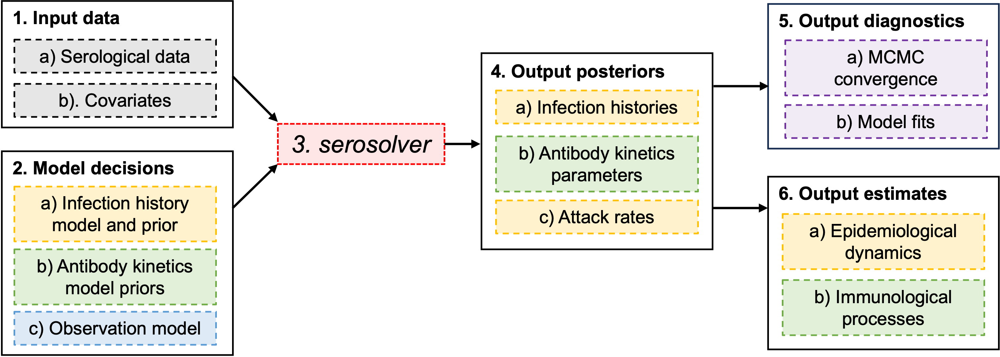

```{r setup, include = FALSE}
knitr::opts_chunk$set(
  collapse = TRUE,
  comment = "#>"
)
```

## Overview

`serosolver` jointly infers antibody kinetics, infection histories and attack rates from cross-sectional or longitudinal serological data, originally described by Kucharski *et al.* @kucharski2018 and developed further by Hay *et al.* @hay2020 . `serosolver` exploits the predictability of antibody kinetics over time following exposure, using one or more antibody level measurements combined with an antibody kinetics model to back-calculate (i.e., extrapolate backwards) the timing of individual infections.

What distinguishes `serosolver` from other such [*time-since-infection*](https://osf.io/preprints/osf/kqdsn) models is a) jointly inferring an antibody kinetics model and infection histories within the same framework; b) the ability to infer multiple infections per person; and c) supporting multi-antigen systems as well as single-antigen problems.

The core of the package is the `serosolver` function, which takes all of the data and model assumptions as inputs and saves Markov chain Monte Carlo (MCMC) outputs to disk. `serosolver` implements a flexible, hierarchical model, meaning that users must be aware of a number of model design decisions. In this vignette, we will show how longitudinal, multi-strain serological data can be cleaned for use in `serosolver`, and walk through the core functionality of the package and post-processing functions.

## Contents

This guide provides an overview of the key components for fitting a `serosolver` model. For more in depth instructions on specific features, see the case study vignettes. We will discuss the following workflow:

```{r fig1, echo=FALSE, fig.cap="Outline of the serosolver workflow", out.width = '100%'}

```

## Entire workflow

The following code runs the entire pipeline for a simulation-recovery experiment with `serosolver`. We will step through each of these sections in more detail in this guide.

```{r entire_simulation,echo=TRUE,eval=FALSE}
library(serosolver)
library(tidyverse)
library(doParallel)
library(data.table)
library(coda)

## Define a vector of all possible infection times
possible_exposure_times <- seq(2000,2024,by=1)

## Vector of antigens with observations, corresponding to times of circulation
sampled_antigens <- seq(min(possible_exposure_times), max(possible_exposure_times), by=2)

## Times at which serum samples can be taken from individuals
sampling_times <- 2020:2024

## Number of serum samples taken per person
n_samps <- 5

## Simulate some random attack rates
attack_rates <- simulate_attack_rates(possible_exposure_times)

## Use example antigenic map (can also be left as NULL)
antigenic_map <- example_antigenic_map[1:25,]
antigenic_map$inf_times <- possible_exposure_times

## Simulate a full serosurvey with these parameters
all_simulated_data <- simulate_data(par_tab=example_par_tab, group=1, n_indiv=50,
                                    possible_exposure_times=possible_exposure_times,
                                    measured_biomarker_ids = sampled_antigens,
                                    sampling_times=sampling_times, nsamps=n_samps,
                                    antigenic_map=antigenic_map,
                                    age_min=10,age_max=75,
                                    attack_rates=attack_rates, repeats=2,
                                    data_type=c(1))

## Pull out the simulated titre data and infection histories
antibody_data <- all_simulated_data$antibody_data
true_inf_hist <- all_simulated_data$infection_histories
plot_antibody_data(antibody_data,possible_exposure_times,1:4,infection_histories = true_inf_hist)

## Run serosolver on the simulated data
output <- serosolver(example_par_tab, antibody_data, 
                                 antigenic_map=antigenic_map,
                filename="readme", n_chains=3,parallel=FALSE,
                mcmc_pars=c(adaptive_iterations=1000, iterations=5000),verbose=TRUE)

## Read in the MCMC chains and compare model fits to the data
chains <- load_mcmc_chains(location=getwd(),par_tab=example_par_tab,burnin = 1000)
plot_model_fits(chain = chains$theta_chain,
                infection_histories = chains$inf_chain,
                known_infection_history = true_inf_hist,
                antibody_data = antibody_data,individuals=1:4,
                antigenic_map=antigenic_map,
                par_tab=example_par_tab,
                orientation="cross-sectional",
                settings=output$settings)
```

```         
```

## Installation and dependencies

Install `serosolver` using the `devtools` package:

```{r,eval=FALSE}
devtools::install_github("seroanalytics/serosolver")
```

Note, that `serosolver` uses `Rcpp` code, including `RcppArmadillo`. You will therefore need a working C++ compiler such as `clang` or `gcc`. The easiest way to set this up is up for Windows users is the [`Rtools`](https://cran.r-project.org/bin/windows/Rtools/rtools43/rtools.html) package. For Mac users, you will need to install a compiler such as [`Xcode`](https://mac.r-project.org/tools/) or [`clang`](https://cran.r-project.org/bin/macosx/tools/).

There are a number of additional package requirements, all of which can be installed from `cran`:

```{r, eval=TRUE,warning=FALSE,message=FALSE}
library(serosolver)
library(ggplot2)
library(dplyr)
library(tidyr)
library(data.table)
library(doParallel)
library(coda)

```

## 1. Input data

### 1.1 Required variables

`serosolver` expects a data frame in long format (i.e., there is a row for each observation), referred to as `antibody_data` in most function arguments, giving the individual ID, sample time, biomarkers or antigens measured, serological measurement, and demographic information:

```{r, eval=TRUE}
data(example_antibody_data)
knitr::kable(head(example_antibody_data))
```

Description of variables:

1.  `individual`: *consecutive* integer ID of individuals from $1,\dots,N$, where $N$ is the number of individuals in the sample.
2.  `sample_time`: integer value of the time period in which a sample was collected.
3.  `biomarker_id`: integer ID of the measured biomarker or antigen.
4.  `biomarker_group`: optional, integer ID of the measurement type.
5.  `measurement`: the measurement for this `individual` against `biomarker_id` at `sample_time`.
6.  `repeat_number`: integer value starting from 1 where repeat measurements are available per sample and `biomarker_id` combination.
7.  `population_group`: integer ID separating individuals within a sample into different groups.
8.  `birth`: integer value giving the time period (matching the supported range of `sample_time`) in which an individual was born.

Data can be cross-sectional samples with multiple biomarkers measured per sample (e.g., multiple influenza strains), such that different `biomarker_id`s correspond to different time periods, or longitudinal samples with one or more biomarkers measured per sample (e.g., measuring measles IgG titers over time).

```{r, eval=TRUE, fig.width=6,fig.height=4,fig.cap="Cross-sectional serology against multiple antigens from multiple serum samples. Plot columns give time periods of sample times, rows give individuals. X-axis gives the time each biomarker ID was assumed to be circulating."}
plot_antibody_data(example_antibody_data,example_antigenic_map$inf_times,n_indivs=1:3,study_design = "cross-sectional")
```

```{r, eval=TRUE, fig.width=6,fig.height=2.5,fig.cap="Longitudinal serology against multiple antigens from multiple serum samples. Plot columns give individuals, rows give biomarker groups (not biomarker IDs!). Points are coloured by biomarker ID. X-axis gives time of sample collection."}
plot_antibody_data(example_antibody_data %>% filter(biomarker_id %in% c(1968,2002,2012)),2010:2015,n_indivs=1:3,study_design = "longitudinal")
```

### 1.2 Serological data

Most applications of `serosolver` involve fitting to antibody titre or concentration data. Make a note of whether your data are continuous or discrete, and the upper and lower bounds of the assay. These will need to be specified in the model later using the `par_tab` object. `serosolver` also supports multiple measurement types per sample, for example, measuring both antibody titre and avidity. These observation types are distinguished by the `biomarker_group` variable --- all observations within a `biomarker_group` are underpinned by their own antibody kinetics model parameters, but arising from the same individual-level infection histories. These will be specified using the `data_type` argument later.

```{r,eval=FALSE}
## Example of two biomarker_groups, one has discrete data one has continuous data
## Set bounds of the assay
par_tab[par_tab$names=="min_measurement" & par_tab$biomarker_group == 1,values] <- lower_bound1
par_tab[par_tab$names=="max_measurement" & par_tab$biomarker_group == 1,values] <- upper_bound1

par_tab[par_tab$names=="min_measurement" & par_tab$biomarker_group == 2,values] <- lower_bound2
par_tab[par_tab$names=="max_measurement" & par_tab$biomarker_group == 2,values] <- upper_bound2

## Set observation type, discrete = 1, continuous = 2
data_type <- c(1,2) ## used in `serosolver::serosolver`, `serosolver::simulate_data` etc
```

### 1.3 Antigenic map

`serosolver` was designed to treat `biomarker_id` as interchangeable with the time variables, such that one antigen ID is assumed to circulate in one time period. For example, `biomarker_id=1968` refers to the antigen assumed to be circulating in 1968. Note that at present, `serosolver` supports only one antigen/biomarker per time period. However, a single `biomarker_id` can be assumed to circulate and dominate for multiple time periods, which can be specified using the `antigenic_map` argument.

The `antigenic_map` object tells `serosolver` how different `biomarker_id`s are antigenically related to each other (using coordinates on an antigenic map), as well as the time periods during which the `biomarker_id` is assumed to be circulating. Setting all antigenic coordinates to the same values tells `serosolver` that there are no antigenic differences between `biomarker_id`s. The same thing can be achieved by setting `antigenic_map=NULL` and instead specifying the `possible_exposure_times` vector.

```{r, eval=FALSE}
## Example antigenic map
data(example_antigenic_map)
knitr::kable(head(example_antigenic_map))

## Antigenic map with no antigenic variation
data.frame(x_coord=1,y_coord=1,inf_times=1:10)

## Antigenic map with clusters
data.frame(x_coord = rep(seq(1,3,by=1),each=3), y_coord=rep(seq(1,3,by=1),each=3),inf_times=1:9)

## Antigenic map with just one biomarker ID
data.frame(x_coord=1,y_coord=1,inf_times=1)

## Antigenic map with two biomarker groups
data.frame(x_coord=1,y_coord=1,inf_times=rep(1:10,2),biomarker_group=rep(c(1,2),each=10))
```

### 1.4 Covariate data

Individuals can't be infected before they're born, and we can't infer infections which occurred after the final sample from each individual. `serosolver` uses the `birth` and `sample_time` variables to constrain which `biomarker_id`s an individual can have been infected by.

The `population_group` variable is used to split individuals into different groups. These might represent different geographic groups, which can be used to estimate separate attack rates, or demographic groups, which can be used to estimate demographic-specific antibody kinetics (or both). For example, we might be interested in comparing attack rates and infection histories between two locations with very different epidemiological dynamics, or estimating different antibody boosting parameters for different age groups. For most simple models, this variable can be ignored or set to 1 for all individuals. \<\<PLACEHOLDER\>\> provides a detailed vignette on how to use covariate data.

## 2 Model decisions

### 2.1 Infection history model and priors

One of the most confusing model design decision in `serosolver` is setting the infection history model. First, we need to understand the epidemiological question we seek to address. If our main objective is to estimate attack rates, we need to think about the power/information we have to estimate attack rates and infection histories at a chosen time resolution (e.g., annual attack rates or per month). If instead our main objective is to understand antibody kinetics, we might wish to simplify the infection history model to allow a more complex antibody kinetics model. The rationale is the same as for any statistical model: identifiability is limited by the data, and thus we should choose as simple a model structure as possible to answer our question.

#### 2.1.1 Model time resolution

All time variables in a `serosolver` model must be at the same time resolution, including `sample_time`, `biomarker_id`, `birth`, and `possible_exposure_times`. This can cause confusion, as these variables must be integers, and thus we have to do some transformation before running `serosolver`:

-   For annual samples, the sample time is simply the year each sample was collected in. For example, data collected between 2009 and 2011 would have values of 2009, 2010, or 2011.

-   For semi-annual samples, the sample time is the year the sample was collected multiplied by 2 (since there are two semesters in every year). For example, data collected between 2009 and 2011 would have values of $(2009 \times 2) + 1 = 4019$, $(2009.5 \times 2) + 1 = 4020$, $(2010 \times 2) + 1 = 4021$, $(2010.5 \times 2) + 1 = 4022$, $(2011 \times 2) + 1 = 4023$, $(2011.5 \times 2) + 1 = 4024$.

-   Similarly, for quarterly or monthly samples, the sample time follows the same pattern. For example for a sample collected in July of 2009, the quarterly sample time would be $(2009.75 \times 4) + 1 = 8040$ (because July is in the third quarter of the year) and the monthly sample time would be $(2009.5833 \times 12) + 1 = 24116$ (because July is the seventh month and $7/12=0.5833$).

A useful feature of `serosolver` is to use *mixed* time resolutions. For example, we might estimate infection histories at an annual resolution up to 2009, and then at a per-quarter resolution thereafter. Another example might be to estimate per-cluster infections for historic periods of time to establish long-term infection histories, and then per-quarter or per-year infection histories during the study period to model shorter-term dynamics. This can be useful for reducing parameter space when we have limited information to draw inferences about particular time periods, but rich information for others. See the \<\<PLACEHOLDER\>\> vignette for more details on this feature.

#### 2.1.2 Model time period

It is possible to estimate infection states just for the duration of the serostudy, or to estimate infection histories for an arbitrary number of time periods prior to the study. For example, we might use serosolver to estimate infections that occurred between two serum sample collection times in the same way we would measure seroconversion rates. Alternatively, we might only have serum samples for recent time periods, but aim to estimate infection histories all the way back to the time of birth.

`serosolver` estimates an infection state for each element of the vector `possible_exposure_times`, which is either passed directly or extract automatically from `antigenic_map$inf_times`. The range and entries of these vectors therefore determines the model time period and resolution of the infection history model.

#### 2.2.3 Infection history priors

A very important consideration, but one which is highly technical and unimportant for most users, is the structure of the prior to place on the individual infection histories.

For most users, the only thing you need to consider is the prior you wish to place on the per-time probability of infection. As individual infection states are modeled as Bernoulli variables (i.e., they can be 0 or 1), an appropriate prior for the per-time probability of infection is a Beta distribution. Thus, by changing the shape and scale parameters of this Beta distribution, we can change the prior on the infection states. For example, we might want to use uninformative priors by setting the shape and scale parameters both to 1. Alternatively, we might have some prior understanding of the probability of infection in each time period — if we think the annual attack rate is around 5%, we might set the Beta distribution shape and scale to 0.5 and 10 (which would give a mean prior attack rate of 5%, try `hist(rbeta(1000, 0.5, 10))`.

Note that `serosolver` assumes the same Beta prior applies to all individuals and all time periods, so choose your Beta parameters carefully.

It is possible to use a separate Beta prior for different population groups, for example, if you want to model the fact that individuals in different locations are under independent forces of infection. This is described in detail in the \<\<PLACEHOLDER\>\> vignette.

It is possible to assume different priors for the infection history model, but this is complex and not necessary for most use cases. You can read more about the different priors in the main [publication](https://pubmed.ncbi.nlm.nih.gov/32365062/), and if you really know what you're doing you can change the prior model with the `prior_version` argument of the main `serosolver` function.

### 2.2 Antibody kinetics model and priors

Along with a data file, serosolver expects several additional inputs namely, a parameter input file for starting values of antibody kinetics parameters, an antigenic map, an age mask, and starting infection histories. The following section will walk the users through creating each of these inputs.

Several input files are stored within the `serosolver` package in the 'inputs' directory, however users can create their own. The default parameter file 'parTab_base.csv' is shown below:

```{r,echo=FALSE,results='asis'}
  options(scipen=999)
  par_tab_path <- system.file("extdata", "par_tab_base.csv", package = "serosolver")
  par_tab <- read.csv(par_tab_path, stringsAsFactors=FALSE)
  par_tab[par_tab$names %in% c("alpha","beta"),"values"] <- c(1,1)
  
  ## Remove phi term for infection history prior version 2
  par_tab <- par_tab[par_tab$type != 2,]
  knitr::kable(par_tab)
```

In the parameter file, the column 'fixed' indicates if each parameter value is fixed or should be estimated. For values that are not fixed, starting values need to be generated. The below code generates a random starting value for unfixed parameter values.

### 2.3 Observation model

## 3. Running *serosolver*

`seroslver` uses an Adaptive Metropolis-within-Gibbs algorithm. Given a starting point and the necessary MCMC parameters, `serosolver()` performs a random-walk of the posterior space to produce an MCMC chain that can be used to generate MCMC density and iteration plots (see section 4).

Using the default options, the MCMC can be run using the following.

```{r, eval=FALSE}
# run MCMC  
  res <- serosolver(par_tab = start_tab, titre_dat = titre_dat, antigenic_map = antigenic_map, 
                  start_inf_hist = start_inf, CREATE_POSTERIOR_FUNC = create_posterior_func,
                  version = 2)
```

If you want to change any default options, such as increasing or decreasing the number of iterations and the adaptive period you can pass a vector of function argument values to `serosolver()`.

```{r, eval=FALSE}
  mcmc_pars <- c("iterations"=50000,"target_acceptance_rate_theta"=0.44,"target_acceptance_rate_inf_hist"=0.44,
                "adaptive_frequency"=1000,"thin"=1,
                "adaptive_iterations"=10000, "save_block"=1000, 
                "thin_inf_hist"=10, "proposal_inf_hist_indiv_prop"=0.5,
                "proposal_ratio"=2, "proposal_inf_hist_time_prop"=0.5, 
                "proposal_inf_hist_distance"=5, "proposal_inf_hist_adaptive"=0,
                "proposal_inf_hist_indiv_swap_ratio"=0.5,"proposal_inf_hist_group_swap_ratio"=0.5,
                "proposal_inf_hist_group_swap_prop"=0.5)
  res <- serosolver(par_tab = start_tab, titre_dat = titre_dat, antigenic_map = antigenic_map, 
                mcmc_pars = mcmc_pars, start_inf_hist = start_inf,
                CREATE_POSTERIOR_FUNC = create_posterior_func, version = 2)
```

## 4. Output posteriors

`serosolver` contains numerous plotting functions for visualising results and evaluating model performance. Below are examples of several useful plotting functions.

## 5. Output diagnostics

To evaluate model performance, trace and density plots can be produced by plotting the MCMC chains. In the below example the adaptive period and burn-in from the MCMC are excluded in the diagnostic plots.

```{r,eval=FALSE}

```

## 6. Output estimates

Plot inferred attack rates.

```{r,eval=FALSE}

```

Plot inferred infection histories.

```{r, eval=FALSE}

```

Plot inferred antibody titres.

```{r,eval=FALSE}

```

Generate cumulative incidence plots.

```{r,eval=FALSE}

```

### Parameter estimates

The following code produces a table of the parameter estimates.

```         
```

## References
